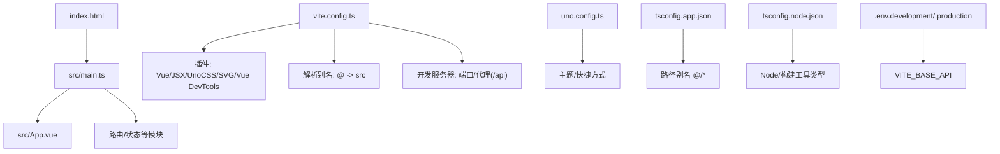
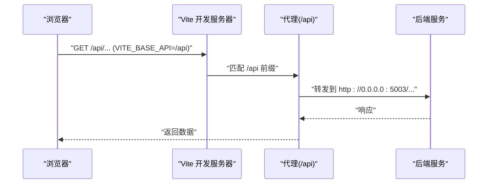
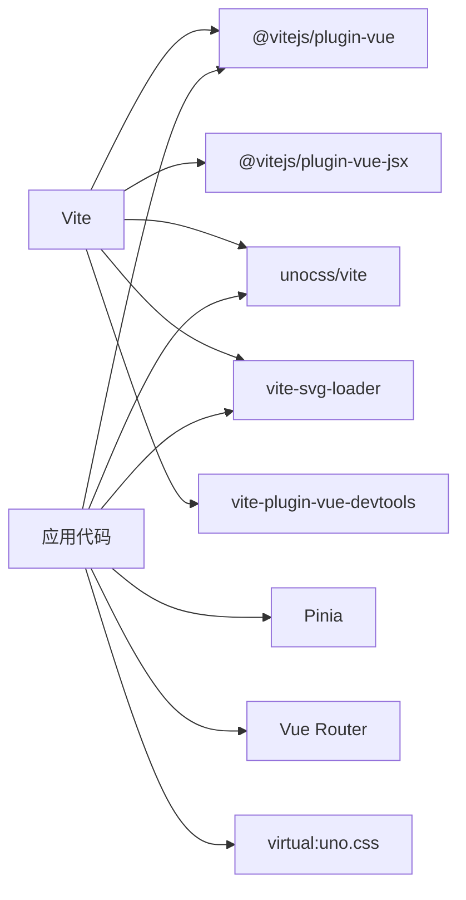

# 构建配置

<cite>
**本文引用的文件**
- [vite.config.ts](file://vite.config.ts)
- [package.json](file://package.json)
- [uno.config.ts](file://uno.config.ts)
- [tsconfig.json](file://tsconfig.json)
- [tsconfig.app.json](file://tsconfig.app.json)
- [tsconfig.node.json](file://tsconfig.node.json)
- [.env.development](file://.env.development)
- [.env.production](file://.env.production)
- [eslint.config.ts](file://eslint.config.ts)
- [.prettierrc.json](file://.prettierrc.json)
- [src/main.ts](file://src/main.ts)
- [src/App.vue](file://src/App.vue)
- [index.html](file://index.html)
- [env.d.ts](file://env.d.ts)
- [src/types/apiTypes.d.ts](file://src/types/apiTypes.d.ts)
</cite>

## 目录
1. [简介](#简介)
2. [项目结构](#项目结构)
3. [核心组件](#核心组件)
4. [架构总览](#架构总览)
5. [详细组件分析](#详细组件分析)
6. [依赖关系分析](#依赖关系分析)
7. [性能考量](#性能考量)
8. [故障排查指南](#故障排查指南)
9. [结论](#结论)
10. [附录](#附录)

## 简介
本文件系统性梳理 LiFocus Web V2 的构建配置与优化策略，围绕 Vite 配置、插件生态、路径别名、开发服务器与代理、TypeScript 编译设置、UnoCSS 主题与快捷方式、环境变量与构建脚本、以及构建性能与常见问题展开，帮助开发者在开发与生产环境中高效迭代与稳定交付。

## 项目结构
该仓库采用 Vite + Vue 3 + TypeScript 技术栈，结合 UnoCSS 实现原子化样式，使用 SVG Loader 处理图标资源，并通过环境变量区分开发与生产 API 基础地址。关键目录与文件如下：
- 构建与工具：vite.config.ts、uno.config.ts、tsconfig*.json、eslint.config.ts、.prettierrc.json
- 运行时入口：index.html、src/main.ts、src/App.vue
- 环境配置：.env.development、.env.production
- 类型声明：env.d.ts、src/types/*.d.ts
- 包管理与脚本：package.json

图表来源
- [vite.config.ts](file://vite.config.ts#L1-L31)
- [uno.config.ts](file://uno.config.ts#L1-L50)
- [tsconfig.app.json](file://tsconfig.app.json#L1-L13)
- [tsconfig.node.json](file://tsconfig.node.json#L1-L20)
- [.env.development](file://.env.development#L1-L4)
- [.env.production](file://.env.production#L1-L2)
- [index.html](file://index.html#L1-L14)
- [src/main.ts](file://src/main.ts#L1-L28)

章节来源
- [vite.config.ts](file://vite.config.ts#L1-L31)
- [uno.config.ts](file://uno.config.ts#L1-L50)
- [tsconfig.app.json](file://tsconfig.app.json#L1-L13)
- [tsconfig.node.json](file://tsconfig.node.json#L1-L20)
- [.env.development](file://.env.development#L1-L4)
- [.env.production](file://.env.production#L1-L2)
- [index.html](file://index.html#L1-L14)
- [src/main.ts](file://src/main.ts#L1-L28)

## 核心组件
- Vite 配置与插件
  - 插件清单：Vue、Vue JSX、UnoCSS、SVG Loader、Vue DevTools
  - 路径别名：@ 指向 src
  - 开发服务器：端口与 /api 代理
- UnoCSS 配置
  - 快捷方式与主题颜色体系
- TypeScript 配置
  - 应用与 Node 工具双配置文件，分别约束应用层与构建/测试工具层
- 环境变量
  - VITE_BASE_API 在开发与生产环境分别指向本地或远端后端
- 代码质量
  - ESLint 规则与 Prettier 格式化配置

章节来源
- [vite.config.ts](file://vite.config.ts#L10-L30)
- [uno.config.ts](file://uno.config.ts#L3-L49)
- [tsconfig.app.json](file://tsconfig.app.json#L1-L13)
- [tsconfig.node.json](file://tsconfig.node.json#L1-L20)
- [.env.development](file://.env.development#L1-L4)
- [.env.production](file://.env.production#L1-L2)
- [eslint.config.ts](file://eslint.config.ts#L1-L23)
- [.prettierrc.json](file://.prettierrc.json#L1-L7)

## 架构总览
下图展示从浏览器请求到后端 API 的关键链路，以及开发服务器如何通过代理转发 /api 请求至后端服务。

图表来源
- [vite.config.ts](file://vite.config.ts#L19-L29)
- [.env.development](file://.env.development#L1-L4)

章节来源
- [vite.config.ts](file://vite.config.ts#L19-L29)
- [.env.development](file://.env.development#L1-L4)

## 详细组件分析

### Vite 配置详解
- 插件配置
  - Vue：支持单文件组件与模板编译
  - Vue JSX：启用 JSX/TSX 渲染函数能力
  - UnoCSS：原子化 CSS，按需生成样式
  - SVG Loader：将 SVG 文件作为 Vue 组件加载，defaultImport 指定为 component
  - Vue DevTools：开发期调试增强
- 路径别名
  - alias: '@' 指向 src，便于在组件中统一导入
- 开发服务器
  - 端口：5173
  - 代理：/api 前缀转发到 http://0.0.0.0:5003，changeOrigin 为 true，rewrite 将 /api 前缀重写
- 入口与运行时
  - index.html 中通过 module script 加载 /src/main.ts
  - src/main.ts 中引入虚拟模块 virtual:uno.css 与全局样式

章节来源
- [vite.config.ts](file://vite.config.ts#L1-L31)
- [index.html](file://index.html#L10-L11)
- [src/main.ts](file://src/main.ts#L10-L11)

### UnoCSS 配置详解
- 快捷方式
  - 提供常用布局与文本截断等组合类，如文本溢出、水平垂直居中等
- 主题
  - 定义主色、背景、字体等颜色层级，便于在组件中直接使用
- 与 Vite 集成
  - 通过 unocss/vite 插件在开发与构建阶段生效

章节来源
- [uno.config.ts](file://uno.config.ts#L3-L49)
- [vite.config.ts](file://vite.config.ts#L4-L4)

### TypeScript 配置详解
- 总入口
  - tsconfig.json 使用 references 引入 node 与 app 两套配置
- 应用层配置
  - 继承 @vue/tsconfig 的 DOM 默认项
  - 路径别名 @/* 对应 ./src/*
  - include 排除测试文件，包含 env.d.ts、所有 .vue 与类型声明
- Node/工具层配置
  - 继承 @tsconfig/node24
  - 模块与解析策略设为 ESNext/Bundler
  - types 仅包含 node，避免 emit
  - include 覆盖 vite.config.*、eslint.config.* 等工具配置文件

章节来源
- [tsconfig.json](file://tsconfig.json#L1-L12)
- [tsconfig.app.json](file://tsconfig.app.json#L1-L13)
- [tsconfig.node.json](file://tsconfig.node.json#L1-L20)

### 环境变量与 API 基础地址
- 开发环境
  - VITE_BASE_API = /api，配合 Vite 代理将 /api 转发到后端
- 生产环境
  - VITE_BASE_API = http://118.25.79.223/api，直接访问远端后端
- 作用范围
  - 仅以 VITE_ 前缀的变量会在客户端打包时注入，确保安全

章节来源
- [.env.development](file://.env.development#L1-L4)
- [.env.production](file://.env.production#L1-L2)

### 代码质量与格式化
- ESLint
  - 基于 @antfu/eslint-config，启用 TypeScript 支持，关闭部分严格规则以适配团队风格
  - 忽略 GitHub、VitePress、VSCode、Cypress 等目录
- Prettier
  - 关闭分号、单引号、指定行长

章节来源
- [eslint.config.ts](file://eslint.config.ts#L1-L23)
- [.prettierrc.json](file://.prettierrc.json#L1-L7)

### 运行时入口与样式加载
- index.html
  - 通过 module script 引入 /src/main.ts
- src/main.ts
  - 引入虚拟 UnoCSS 样式模块 virtual:uno.css
  - 引入 tdesign、animate.css、simplebar 等全局样式
  - 创建应用实例、注册 Pinia/Pinia 持久化、路由并挂载

章节来源
- [index.html](file://index.html#L10-L11)
- [src/main.ts](file://src/main.ts#L10-L15)

## 依赖关系分析
- 构建与运行时依赖
  - Vue 3、Vue Router、Pinia、UnoCSS、vite-svg-loader、vite-plugin-vue-devtools
- 开发与类型依赖
  - Vite、TypeScript、vue-tsc、@vitejs/plugin-vue、@vitejs/plugin-vue-jsx、@tsconfig/node24、@vue/tsconfig
- 质量工具
  - ESLint、Prettier、@antfu/eslint-config

图表来源
- [vite.config.ts](file://vite.config.ts#L2-L7)
- [src/main.ts](file://src/main.ts#L10-L11)
- [package.json](file://package.json#L18-L58)

章节来源
- [package.json](file://package.json#L18-L58)
- [vite.config.ts](file://vite.config.ts#L2-L7)
- [src/main.ts](file://src/main.ts#L10-L11)

## 性能考量
- 代码分割与懒加载
  - 使用 Vue Router 的异步组件与动态 import，实现页面级代码分割
  - 在大型页面或第三方库中按需加载，减少首屏体积
- Tree Shaking
  - 保持 ES Module 导入导出语法，避免副作用代码；对无用导出进行命名导出
  - 第三方库尽量选择 ESM 版本，提升摇树效果
- 压缩与产物优化
  - 生产构建默认启用最小化；可结合压缩器参数进一步优化
  - 对图片与 SVG 使用 UnoCSS 与 SVG Loader，减少冗余资源
- 缓存策略
  - 利用浏览器缓存与长效缓存策略（如静态资源带哈希）
  - 通过 CDN 或反向代理设置合理的 Cache-Control
- 开发体验
  - 使用 Vue DevTools 插件辅助调试
  - 合理拆分模块，缩短热更新时间

## 故障排查指南
- 代理不生效或 404
  - 确认 /api 前缀是否与前端请求一致，检查代理 target 与 rewrite 配置
  - 确保 changeOrigin 为 true，允许跨域主机头变更
- 环境变量未注入
  - 变量必须以 VITE_ 前缀命名，否则不会注入到客户端
  - 检查 .env.development 与 .env.production 是否正确放置
- UnoCSS 样式未生效
  - 确认已引入 virtual:uno.css，且 UnoCSS 插件已在 Vite 中启用
  - 检查类名拼写与快捷方式是否正确
- TypeScript 类型错误
  - 使用 vue-tsc --build 进行类型检查；修复 app 与 node 配置中的 include/exclude
  - 确保 env.d.ts 正确声明 Vite 环境类型
- ESLint/Prettier 冲突
  - 使用 Prettier 格式化后再执行 ESLint 自动修复
  - 如需放宽规则，可在 eslint.config.ts 中调整 rules

章节来源
- [vite.config.ts](file://vite.config.ts#L19-L29)
- [.env.development](file://.env.development#L1-L4)
- [.env.production](file://.env.production#L1-L2)
- [src/main.ts](file://src/main.ts#L10-L11)
- [uno.config.ts](file://uno.config.ts#L3-L49)
- [tsconfig.app.json](file://tsconfig.app.json#L1-L13)
- [tsconfig.node.json](file://tsconfig.node.json#L1-L20)
- [eslint.config.ts](file://eslint.config.ts#L1-L23)
- [.prettierrc.json](file://.prettierrc.json#L1-L7)

## 结论
本项目构建配置以 Vite 为核心，结合 Vue 3、UnoCSS、SVG Loader 与 TypeScript，形成清晰的开发与生产流程。通过合理的路径别名、代理与环境变量配置，以及完善的类型与质量工具链，能够在保证开发效率的同时，获得稳定的构建产物。建议在后续迭代中持续关注代码分割与缓存策略，以进一步提升首屏性能与用户体验。

## 附录
- 关键配置要点速览
  - Vite 插件：Vue、JSX、UnoCSS、SVG Loader、Vue DevTools
  - 路径别名：@ -> src
  - 开发服务器：端口 5173，/api 代理到 http://0.0.0.0:5003
  - UnoCSS：主题与快捷方式
  - TypeScript：app 与 node 双配置，references 引入
  - 环境变量：VITE_BASE_API 分环境配置
  - 质量工具：ESLint(@antfu) 与 Prettier