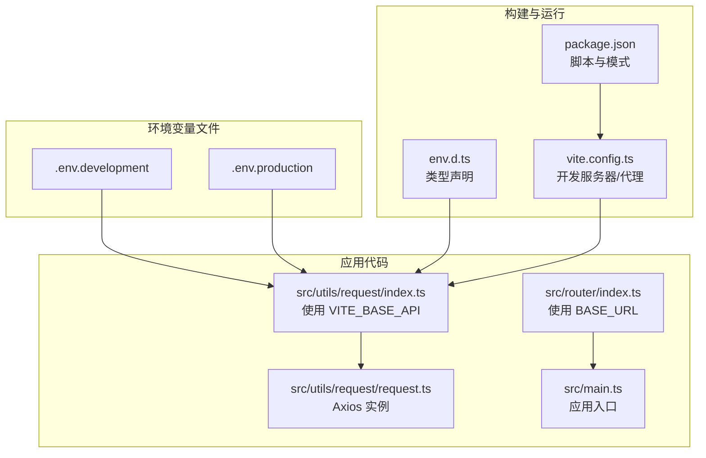
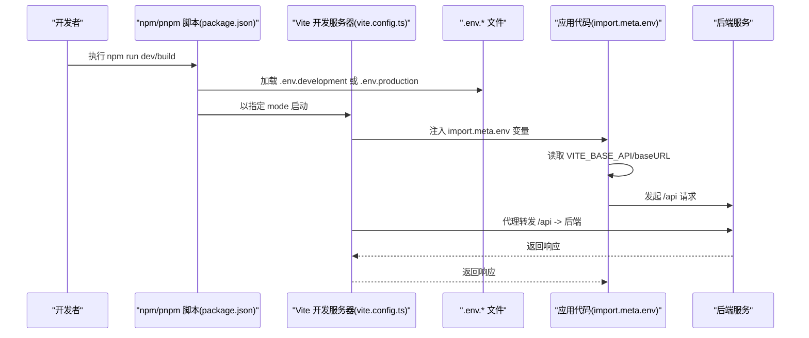
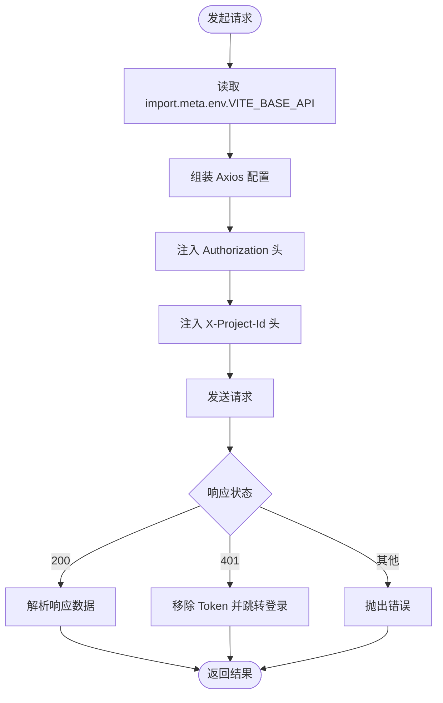
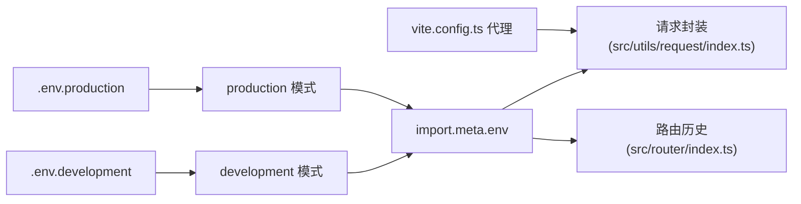

# 环境配置

<cite>
**本文引用的文件**
- [.env.development](file://.env.development)
- [.env.production](file://.env.production)
- [env.d.ts](file://env.d.ts)
- [vite.config.ts](file://vite.config.ts)
- [package.json](file://package.json)
- [src/utils/request/index.ts](file://src/utils/request/index.ts)
- [src/utils/request/request.ts](file://src/utils/request/request.ts)
- [src/router/index.ts](file://src/router/index.ts)
- [src/main.ts](file://src/main.ts)
- [.gitignore](file://.gitignore)
- [eslint.config.ts](file://eslint.config.ts)
</cite>

## 目录
1. [简介](#简介)
2. [项目结构](#项目结构)
3. [核心组件](#核心组件)
4. [架构总览](#架构总览)
5. [详细组件分析](#详细组件分析)
6. [依赖分析](#依赖分析)
7. [性能考虑](#性能考虑)
8. [故障排查指南](#故障排查指南)
9. [结论](#结论)
10. [附录](#附录)

## 简介
本指南面向 LiFocus Web V2 的环境配置管理，聚焦以下目标：
- 明确开发与生产环境的配置差异与切换方式
- 解释 .env 文件的命名规范、结构与加载机制
- 说明如何在代码中安全访问环境变量
- 提供敏感信息保护策略（如 API 基地址等）
- 给出环境切换最佳实践与配置验证方法
- 提供不同部署环境的配置模板与迁移建议

## 项目结构
围绕环境配置的关键文件与位置如下：
- 环境变量文件：.env.development、.env.production
- 类型声明：env.d.ts
- 构建与开发服务器：vite.config.ts
- 脚本与模式：package.json
- 代码中使用环境变量的位置：请求封装、路由历史基路径
- 版本控制忽略：.gitignore
- Lint 配置：eslint.config.ts

图表来源
- [.env.development](file://.env.development#L1-L4)
- [.env.production](file://.env.production#L1-L2)
- [env.d.ts](file://env.d.ts#L1-L2)
- [vite.config.ts](file://vite.config.ts#L1-L31)
- [package.json](file://package.json#L9-L17)
- [src/utils/request/index.ts](file://src/utils/request/index.ts#L12-L13)
- [src/utils/request/request.ts](file://src/utils/request/request.ts#L1-L99)
- [src/router/index.ts](file://src/router/index.ts#L76-L77)
- [src/main.ts](file://src/main.ts#L1-L28)

章节来源
- [package.json](file://package.json#L9-L17)
- [vite.config.ts](file://vite.config.ts#L1-L31)
- [.env.development](file://.env.development#L1-L4)
- [.env.production](file://.env.production#L1-L2)
- [env.d.ts](file://env.d.ts#L1-L2)

## 核心组件
- 环境变量文件
  - .env.development：用于本地开发，包含 VITE_BASE_API 等前端可访问的变量
  - .env.production：用于生产构建，包含 VITE_BASE_API 等前端可访问的变量
- 类型声明
  - env.d.ts：为 Vite 环境变量提供类型支持，确保 import.meta.env 下的变量具备类型提示
- 构建与开发服务器
  - vite.config.ts：定义开发服务器端口、代理规则；代理将 /api 请求转发到后端服务
- 代码中的使用点
  - 请求封装：通过 import.meta.env.VITE_BASE_API 组装 baseURL
  - 路由历史基路径：通过 import.meta.env.BASE_URL 初始化浏览器历史模式路由
- 脚本与模式
  - package.json 中的 scripts 使用 --mode development/production 控制加载对应 .env.* 文件

章节来源
- [.env.development](file://.env.development#L1-L4)
- [.env.production](file://.env.production#L1-L2)
- [env.d.ts](file://env.d.ts#L1-L2)
- [vite.config.ts](file://vite.config.ts#L19-L29)
- [src/utils/request/index.ts](file://src/utils/request/index.ts#L12-L13)
- [src/router/index.ts](file://src/router/index.ts#L76-L77)
- [package.json](file://package.json#L9-L17)

## 架构总览
下图展示了从环境变量到应用运行的整体流程：构建阶段加载 .env.*，运行时通过 import.meta.env 访问；开发服务器通过代理将 /api 请求转发至后端。

图表来源
- [package.json](file://package.json#L9-L17)
- [vite.config.ts](file://vite.config.ts#L19-L29)
- [.env.development](file://.env.development#L1-L4)
- [.env.production](file://.env.production#L1-L2)
- [src/utils/request/index.ts](file://src/utils/request/index.ts#L12-L13)
- [src/router/index.ts](file://src/router/index.ts#L76-L77)

## 详细组件分析

### 环境变量文件与命名规范
- 文件命名
  - .env.development：开发环境变量
  - .env.production：生产环境变量
- 加载规则
  - Vite 在启动时会按 --mode 加载对应 .env.* 文件；开发模式加载 .env.development，生产模式加载 .env.production
- 变量前缀
  - 仅以 VITE_ 开头的变量会在客户端打包后生效；例如 VITE_BASE_API
  - 其他变量不会暴露给前端代码
- 结构示例
  - .env.development：包含 VITE_BASE_API=... 等键值对
  - .env.production：包含 VITE_BASE_API=... 等键值对

章节来源
- [.env.development](file://.env.development#L1-L4)
- [.env.production](file://.env.production#L1-L2)
- [package.json](file://package.json#L9-L17)

### 类型声明与导入
- env.d.ts
  - 通过 /// <reference types="vite/client" /> 为 import.meta.env 提供类型支持
- 在代码中访问
  - import.meta.env.VITE_BASE_API：用于请求封装
  - import.meta.env.BASE_URL：用于路由历史模式初始化

章节来源
- [env.d.ts](file://env.d.ts#L1-L2)
- [src/utils/request/index.ts](file://src/utils/request/index.ts#L12-L13)
- [src/router/index.ts](file://src/router/index.ts#L76-L77)

### 构建与开发服务器配置
- 开发服务器
  - 端口：5173
  - 代理：将 /api 请求转发至后端服务地址
- 生产构建
  - 通过 VITE_BASE_API 决定 API 基础地址
- 模式切换
  - npm run dev 使用 development 模式
  - npm run build 使用 production 模式

章节来源
- [vite.config.ts](file://vite.config.ts#L19-L29)
- [package.json](file://package.json#L9-L17)

### 代码中的使用点

#### 请求封装与 API 基地址
- 作用：统一设置 baseURL，注入认证头与项目上下文头
- 关键点：
  - 从 import.meta.env.VITE_BASE_API 读取基础地址
  - 自动附加 Authorization 与 X-Project-Id 头
  - 对 401 响应进行登出与跳转处理

图表来源
- [src/utils/request/index.ts](file://src/utils/request/index.ts#L12-L39)
- [src/utils/request/request.ts](file://src/utils/request/request.ts#L26-L40)

章节来源
- [src/utils/request/index.ts](file://src/utils/request/index.ts#L12-L39)
- [src/utils/request/request.ts](file://src/utils/request/request.ts#L26-L40)

#### 路由历史基路径
- 作用：在浏览器历史模式下正确解析页面路径
- 关键点：使用 import.meta.env.BASE_URL 初始化 createWebHistory

章节来源
- [src/router/index.ts](file://src/router/index.ts#L76-L77)

### 敏感信息与安全
- 前端可见范围
  - 仅 VITE_ 前缀变量会暴露给前端；因此 API 基地址等可在前端使用
- 不应在前端存储敏感信息（如数据库密码、私钥）
- 代理与跨域
  - 开发时通过 Vite 代理将 /api 请求转发至后端，避免直接暴露后端地址
- 版本控制
  - .gitignore 已包含常见构建产物与日志，不建议提交 .env.* 文件

章节来源
- [.env.development](file://.env.development#L1-L4)
- [.env.production](file://.env.production#L1-L2)
- [vite.config.ts](file://vite.config.ts#L21-L27)
- [.gitignore](file://.gitignore#L1-L37)

## 依赖分析
- 环境变量依赖链
  - .env.* → Vite 模式加载 → import.meta.env 注入 → 应用代码读取
- 关键耦合点
  - VITE_BASE_API 与后端服务地址强相关
  - BASE_URL 与路由历史模式基路径相关
- 代理依赖
  - vite.config.ts 的代理配置影响 /api 请求能否正确转发

图表来源
- [.env.development](file://.env.development#L1-L4)
- [.env.production](file://.env.production#L1-L2)
- [package.json](file://package.json#L9-L17)
- [src/utils/request/index.ts](file://src/utils/request/index.ts#L12-L13)
- [src/router/index.ts](file://src/router/index.ts#L76-L77)
- [vite.config.ts](file://vite.config.ts#L21-L27)

章节来源
- [package.json](file://package.json#L9-L17)
- [vite.config.ts](file://vite.config.ts#L21-L27)
- [src/utils/request/index.ts](file://src/utils/request/index.ts#L12-L13)
- [src/router/index.ts](file://src/router/index.ts#L76-L77)

## 性能考虑
- 代理仅在开发环境启用，生产构建通过 VITE_BASE_API 直接访问后端，避免额外网络开销
- 合理设置请求超时与重试策略（当前封装默认 60000ms），避免阻塞用户交互
- 避免在请求头中携带不必要的敏感信息，减少每次请求的数据体积

## 故障排查指南
- 症状：开发时 /api 请求 404 或跨域
  - 排查：确认 vite.config.ts 代理配置是否正确，target 是否可达
  - 参考：[vite.config.ts](file://vite.config.ts#L21-L27)
- 症状：生产环境无法访问后端
  - 排查：确认 .env.production 中 VITE_BASE_API 是否指向正确的后端地址
  - 参考：[.env.production](file://.env.production#L1-L2)
- 症状：路由路径异常（刷新后 404）
  - 排查：确认 BASE_URL 是否正确传入 createWebHistory
  - 参考：[src/router/index.ts](file://src/router/index.ts#L76-L77)
- 症状：类型提示缺失或编译报错
  - 排查：确认 env.d.ts 是否存在且包含 Vite 类型声明
  - 参考：[env.d.ts](file://env.d.ts#L1-L2)
- 症状：环境变量未生效
  - 排查：确认 package.json 中脚本使用的 mode 是否与 .env.* 文件匹配
  - 参考：[package.json](file://package.json#L9-L17)

章节来源
- [vite.config.ts](file://vite.config.ts#L21-L27)
- [.env.production](file://.env.production#L1-L2)
- [src/router/index.ts](file://src/router/index.ts#L76-L77)
- [env.d.ts](file://env.d.ts#L1-L2)
- [package.json](file://package.json#L9-L17)

## 结论
- LiFocus Web V2 采用 Vite 的模式化环境变量管理，通过 .env.development/.env.production 与 import.meta.env 实现开发与生产的差异化配置
- 仅 VITE_ 前缀变量可被前端访问，API 基地址通过 VITE_BASE_API 注入请求封装
- 开发代理与路由基路径是环境切换的关键点，需与后端服务保持一致
- 建议将敏感信息留在后端或服务端配置，前端仅保留必要的运行参数

## 附录

### 开发与生产配置模板
- .env.development（示例字段）
  - VITE_BASE_API：本地后端地址（如 /api）
- .env.production（示例字段）
  - VITE_BASE_API：生产后端地址（如 http://公网IP/api）

章节来源
- [.env.development](file://.env.development#L1-L4)
- [.env.production](file://.env.production#L1-L2)

### 环境切换最佳实践
- 使用 npm run dev 与 npm run build 分别加载 development 与 production 模式
- 在 CI/CD 中通过构建参数选择 mode，并在部署前校验 .env.* 文件
- 本地开发使用代理，生产环境通过 VITE_BASE_API 直连后端

章节来源
- [package.json](file://package.json#L9-L17)
- [vite.config.ts](file://vite.config.ts#L19-L29)

### 配置验证清单
- [ ] 确认 .env.development/.env.production 存在且包含 VITE_BASE_API
- [ ] 确认 env.d.ts 包含 Vite 类型声明
- [ ] 确认 vite.config.ts 代理 target 与后端实际地址一致
- [ ] 确认路由历史基路径使用 import.meta.env.BASE_URL
- [ ] 确认 .gitignore 不包含 .env.* 文件

章节来源
- [.env.development](file://.env.development#L1-L4)
- [.env.production](file://.env.production#L1-L2)
- [env.d.ts](file://env.d.ts#L1-L2)
- [vite.config.ts](file://vite.config.ts#L19-L29)
- [src/router/index.ts](file://src/router/index.ts#L76-L77)
- [.gitignore](file://.gitignore#L1-L37)