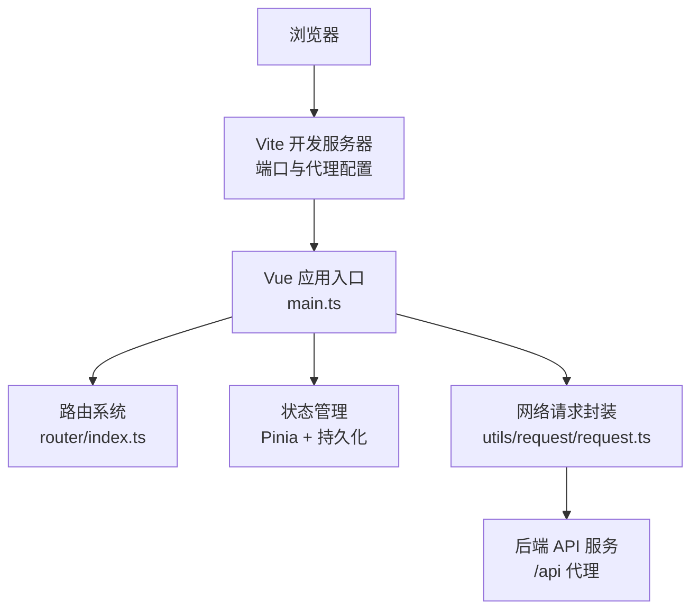
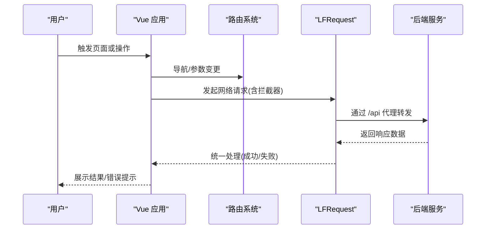
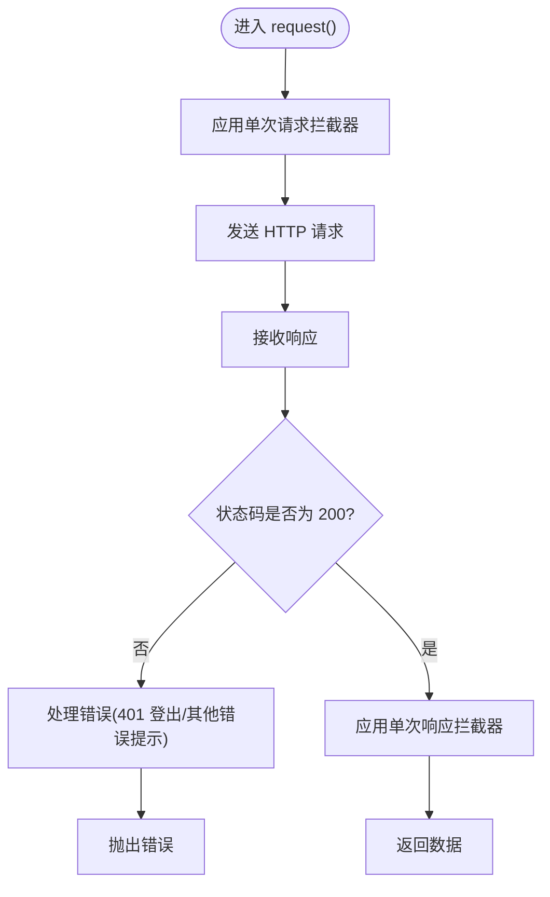
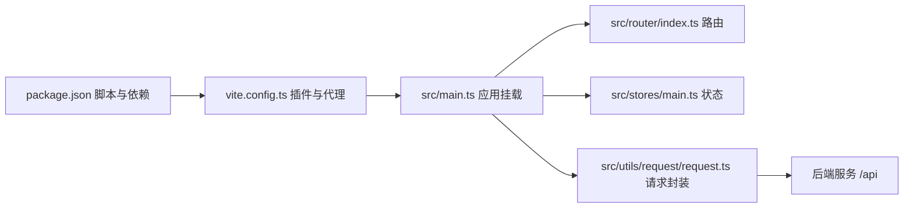

# 监控运维

<cite>
**本文引用的文件**
- [package.json](file://package.json)
- [vite.config.ts](file://vite.config.ts)
- [src/main.ts](file://src/main.ts)
- [src/App.vue](file://src/App.vue)
- [src/router/index.ts](file://src/router/index.ts)
- [src/utils/request/request.ts](file://src/utils/request/request.ts)
- [src/utils/request/type.ts](file://src/utils/request/type.ts)
- [src/utils/auth.ts](file://src/utils/auth.ts)
- [src/hooks/useTdMessage.ts](file://src/hooks/useTdMessage.ts)
- [src/hooks/useCustomMessage.ts](file://src/hooks/useCustomMessage.ts)
- [src/stores/main.ts](file://src/stores/main.ts)
- [src/layout/ProjectLayout/index.vue](file://src/layout/ProjectLayout/index.vue)
- [src/views/dashboard/index.vue](file://src/views/dashboard/index.vue)
- [src/views/auth/Login.vue](file://src/views/auth/Login.vue)
- [index.html](file://index.html)
</cite>

## 目录
1. [简介](#简介)
2. [项目结构](#项目结构)
3. [核心组件](#核心组件)
4. [架构总览](#架构总览)
5. [详细组件分析](#详细组件分析)
6. [依赖关系分析](#依赖关系分析)
7. [性能考量](#性能考量)
8. [故障排查指南](#故障排查指南)
9. [结论](#结论)
10. [附录](#附录)

## 简介
本指南面向 LiFocus Web V2 的监控运维实践，聚焦以下方面：
- 应用性能监控：前端性能指标采集与分析思路（基于现有请求层与路由体系）。
- 错误追踪与日志：统一错误拦截、消息提示与会话状态管理。
- 服务器监控与健康检查：代理配置与后端接口连通性保障。
- 告警机制与通知策略：基于错误拦截与消息提示的分级通知。
- 故障诊断与问题排查：结合请求拦截器与路由守卫的定位手段。
- 运维自动化与批量操作：通过构建脚本与环境配置实现标准化流程。

## 项目结构
LiFocus Web V2 采用 Vue 3 + Vite 架构，核心入口为应用挂载与路由配置，网络请求通过统一封装的 LFRequest 实现，状态持久化由 Pinia 插件支持。开发与生产环境通过 Vite 配置与环境变量区分，本地开发通过代理指向后端服务。

图表来源
- [vite.config.ts](file://vite.config.ts#L19-L30)
- [src/main.ts](file://src/main.ts#L17-L27)
- [src/router/index.ts](file://src/router/index.ts#L76-L79)
- [src/utils/request/request.ts](file://src/utils/request/request.ts#L9-L51)

章节来源
- [vite.config.ts](file://vite.config.ts#L1-L31)
- [src/main.ts](file://src/main.ts#L1-L28)
- [src/router/index.ts](file://src/router/index.ts#L1-L82)

## 核心组件
- 请求封装与拦截：LFRequest 提供统一的请求/响应拦截器，集中处理鉴权状态与错误提示，并支持单次请求的拦截器扩展。
- 路由与页面：路由负责页面切换与权限相关跳转；登录页完成认证流程并触发消息提示。
- 状态管理：Pinia Store 结合持久化插件，保存当前项目 ID 等关键状态。
- 消息提示：useTdMessage 与 useCustomMessage 提供统一的消息展示能力，便于错误与成功反馈。
- 认证工具：token 存取与移除逻辑，支持 Cookie 与 SessionStorage 两种存储方式。

章节来源
- [src/utils/request/request.ts](file://src/utils/request/request.ts#L9-L99)
- [src/utils/request/type.ts](file://src/utils/request/type.ts#L1-L15)
- [src/hooks/useTdMessage.ts](file://src/hooks/useTdMessage.ts#L1-L60)
- [src/hooks/useCustomMessage.ts](file://src/hooks/useCustomMessage.ts#L1-L73)
- [src/stores/main.ts](file://src/stores/main.ts#L1-L21)
- [src/utils/auth.ts](file://src/utils/auth.ts#L1-L71)
- [src/views/auth/Login.vue](file://src/views/auth/Login.vue#L38-L80)

## 架构总览
前端到后端的典型调用链路如下：

图表来源
- [src/router/index.ts](file://src/router/index.ts#L76-L79)
- [src/utils/request/request.ts](file://src/utils/request/request.ts#L55-L75)
- [vite.config.ts](file://vite.config.ts#L21-L28)

## 详细组件分析

### 请求与错误处理（LFRequest）
- 功能要点
  - 全局请求/响应拦截器：统一注入与处理。
  - 单次请求拦截器：支持按需覆盖请求/响应处理逻辑。
  - 错误分支处理：针对 401 状态执行登出与跳转，其他非 200 错误统一拒绝并返回错误信息。
- 性能与可观测性建议
  - 在请求拦截器中埋点记录请求开始时间与 URL，响应拦截器记录耗时与状态码，形成基础的前端性能指标。
  - 将错误信息与用户上下文（如用户 ID、项目 ID）关联，便于后续检索与聚合。

图表来源
- [src/utils/request/request.ts](file://src/utils/request/request.ts#L55-L75)
- [src/utils/request/request.ts](file://src/utils/request/request.ts#L26-L40)

章节来源
- [src/utils/request/request.ts](file://src/utils/request/request.ts#L9-L99)
- [src/utils/request/type.ts](file://src/utils/request/type.ts#L1-L15)

### 路由与页面导航
- 功能要点
  - 定义登录、仪表盘、项目工作台等路由，支持懒加载组件。
  - 顶部布局根据路由名称初始化标签页类型，实现页面间快速切换。
- 运维意义
  - 路由变更可作为用户行为轨迹的一部分，结合请求拦截器可统计页面级性能与错误分布。

章节来源
- [src/router/index.ts](file://src/router/index.ts#L1-L82)
- [src/layout/ProjectLayout/index.vue](file://src/layout/ProjectLayout/index.vue#L57-L72)

### 登录流程与消息提示
- 功能要点
  - 表单校验通过后调用登录接口，成功后写入 token 并跳转至仪表盘；失败时通过消息提示组件反馈。
  - 使用 useTdMessage 提供统一的成功/错误提示。
- 运维意义
  - 登录成功率与失败原因可作为安全与可用性的关键指标。

章节来源
- [src/views/auth/Login.vue](file://src/views/auth/Login.vue#L38-L80)
- [src/hooks/useTdMessage.ts](file://src/hooks/useTdMessage.ts#L1-L60)
- [src/utils/auth.ts](file://src/utils/auth.ts#L12-L45)

### 状态管理与持久化
- 功能要点
  - 当前项目 ID 等状态通过 Pinia Store 管理，并启用持久化以提升用户体验。
- 运维意义
  - 持久化状态可用于跨会话的指标恢复与一致性校验。

章节来源
- [src/stores/main.ts](file://src/stores/main.ts#L1-L21)

### 消息提示与自定义消息
- 功能要点
  - useTdMessage：基于 tdesign-vue-next 的消息插件，提供成功/错误/警告/信息等类型。
  - useCustomMessage：通过虚拟 DOM 渲染自定义消息组件，支持手动关闭与定时销毁。
- 运维意义
  - 统一的消息展示有助于用户侧错误感知与自助排查。

章节来源
- [src/hooks/useTdMessage.ts](file://src/hooks/useTdMessage.ts#L1-L60)
- [src/hooks/useCustomMessage.ts](file://src/hooks/useCustomMessage.ts#L1-L73)

### 认证与会话管理
- 功能要点
  - 支持 Cookie 与 SessionStorage 两种存储方式，满足“记住我”场景。
  - 提供 token 写入、读取与移除方法，配合 401 错误处理实现自动登出。
- 运维意义
  - 会话生命周期与过期策略直接影响系统稳定性与安全性。

章节来源
- [src/utils/auth.ts](file://src/utils/auth.ts#L12-L71)

## 依赖关系分析
- 构建与开发
  - Vite 提供开发服务器、代理与构建能力；插件包括 Vue、UnoCSS、SVG 加载等。
  - 脚本命令涵盖开发、构建、预览与类型检查。
- 运行时依赖
  - Vue 3、Vue Router、Pinia、tdesign-vue-next、axios 等构成前端运行时生态。
- 代理与后端通信
  - 本地开发通过 /api 代理转发到后端服务，确保前后端联调顺畅。

图表来源
- [package.json](file://package.json#L9-L16)
- [vite.config.ts](file://vite.config.ts#L10-L30)
- [src/main.ts](file://src/main.ts#L17-L27)
- [src/router/index.ts](file://src/router/index.ts#L76-L79)
- [src/utils/request/request.ts](file://src/utils/request/request.ts#L9-L51)

章节来源
- [package.json](file://package.json#L1-L60)
- [vite.config.ts](file://vite.config.ts#L1-L31)

## 性能考量
- 前端性能指标采集建议
  - 在请求拦截器中记录请求开始时间与 URL，在响应拦截器中记录耗时与状态码，形成基础的前端性能指标（如 P95/P99 响应时间）。
  - 结合路由切换统计页面首屏渲染与交互延迟，辅助定位性能瓶颈。
- 资源与体积优化
  - 保持现有动态导入与组件懒加载策略，减少初始包体。
  - 通过 UnoCSS 与 SVG Loader 控制样式与图标体积。
- 代理与网络
  - 本地代理仅在开发环境生效，生产环境通过 CDN 或反向代理分发，确保低延迟与高可用。

章节来源
- [vite.config.ts](file://vite.config.ts#L19-L30)
- [src/utils/request/request.ts](file://src/utils/request/request.ts#L17-L24)

## 故障排查指南
- 常见问题定位步骤
  - 登录失败：检查登录接口返回码与消息，确认 useTdMessage 是否正确展示；核对 token 写入逻辑与 Cookie/SessionStorage 状态。
  - 401 未授权：确认响应拦截器是否触发登出与跳转；检查后端鉴权中间件与令牌有效期。
  - 接口超时/失败：通过请求拦截器记录的 URL 与时间戳定位慢请求；结合后端日志与网络面板分析。
  - 页面无法跳转：检查路由配置与懒加载组件是否正确加载。
- 日志与消息
  - 使用 useTdMessage 与 useCustomMessage 快速反馈错误与状态，便于一线运维与用户自助排查。

章节来源
- [src/views/auth/Login.vue](file://src/views/auth/Login.vue#L63-L77)
- [src/utils/request/request.ts](file://src/utils/request/request.ts#L31-L38)
- [src/hooks/useTdMessage.ts](file://src/hooks/useTdMessage.ts#L1-L60)
- [src/hooks/useCustomMessage.ts](file://src/hooks/useCustomMessage.ts#L1-L73)

## 结论
LiFocus Web V2 已具备完善的前端监控运维基础：统一的请求封装、路由与状态管理、消息提示与认证工具。在此基础上，建议进一步引入前端性能指标采集、错误追踪与日志上报、以及与后端健康检查与告警平台的联动，以实现从“可观测”到“可预警”的闭环。

## 附录
- 构建与预览
  - 开发：通过脚本启动本地开发服务器，自动热更新。
  - 构建：生成静态资源，适配生产环境部署。
  - 预览：本地预览构建产物，验证打包效果。
- 环境与代理
  - 本地开发通过 /api 代理访问后端服务，确保前后端联调稳定。

章节来源
- [package.json](file://package.json#L9-L16)
- [vite.config.ts](file://vite.config.ts#L19-L30)
- [index.html](file://index.html#L1-L13)