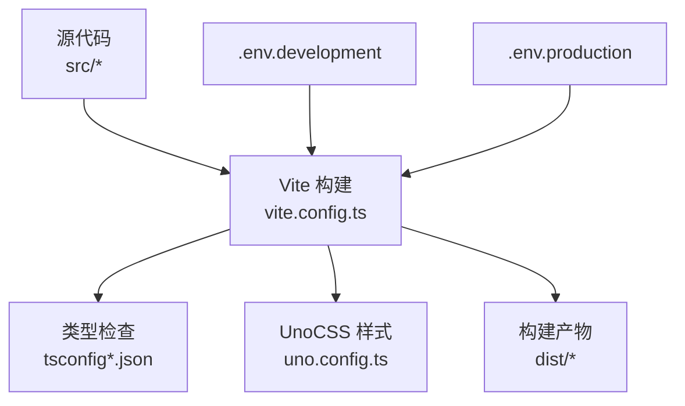
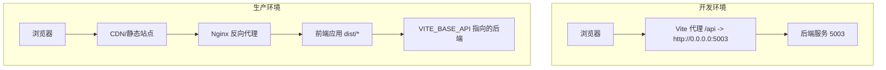
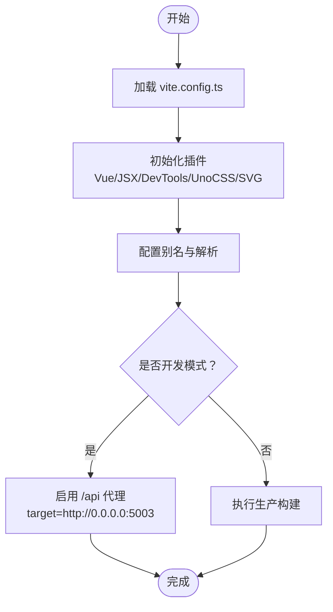
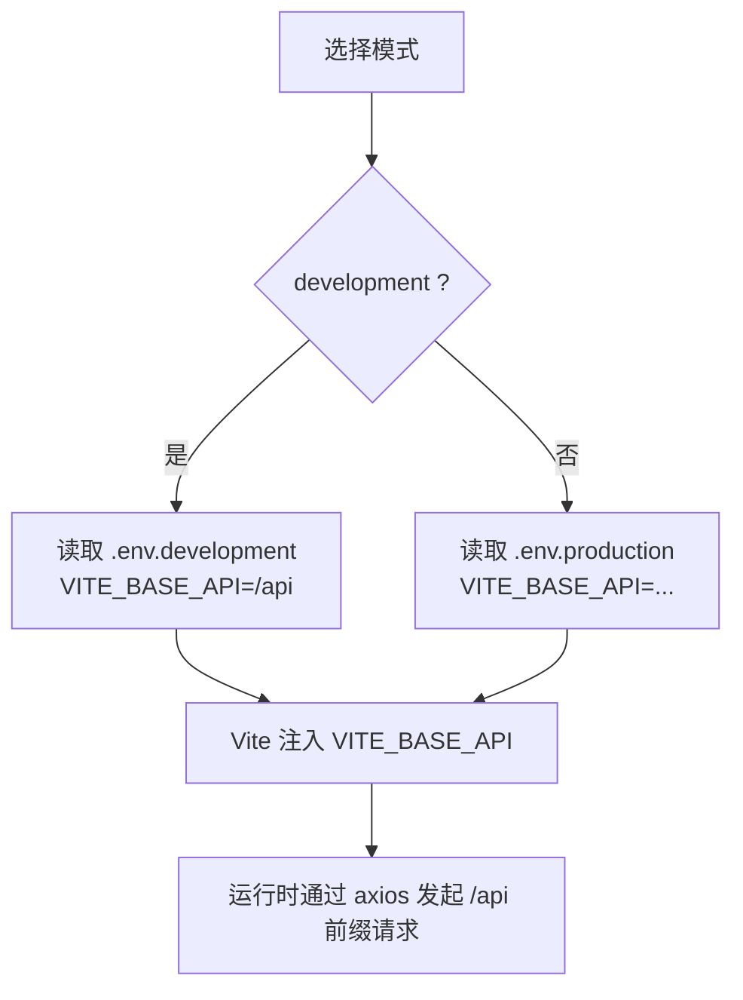
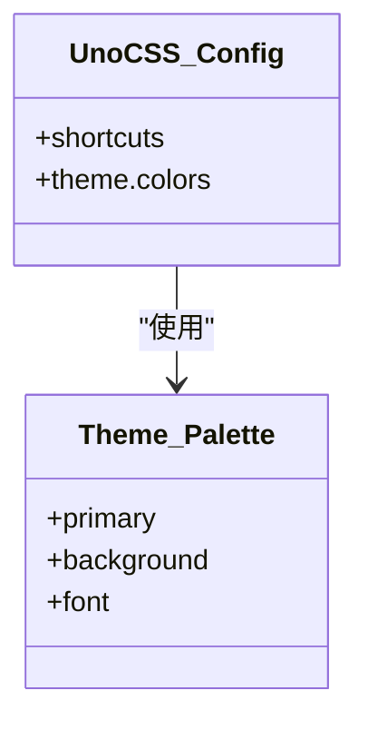
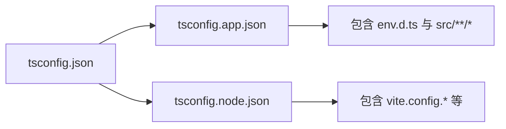
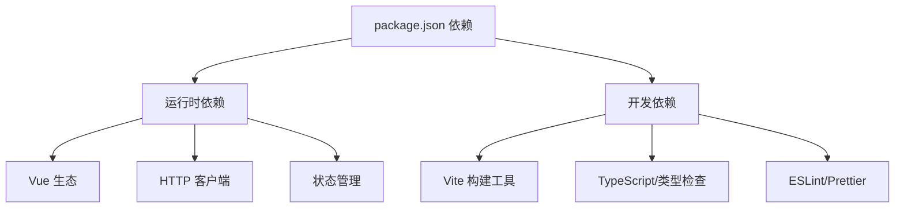

# 部署与运维

<cite>
**本文引用的文件**
- [package.json](file://package.json)
- [vite.config.ts](file://vite.config.ts)
- [.env.production](file://.env.production)
- [.env.development](file://.env.development)
- [uno.config.ts](file://uno.config.ts)
- [tsconfig.json](file://tsconfig.json)
- [tsconfig.app.json](file://tsconfig.app.json)
- [tsconfig.node.json](file://tsconfig.node.json)
- [eslint.config.ts](file://eslint.config.ts)
- [README.md](file://README.md)
</cite>

## 目录
1. [简介](#简介)
2. [项目结构](#项目结构)
3. [核心组件](#核心组件)
4. [架构总览](#架构总览)
5. [详细组件分析](#详细组件分析)
6. [依赖分析](#依赖分析)
7. [性能考量](#性能考量)
8. [故障排除指南](#故障排除指南)
9. [结论](#结论)
10. [附录](#附录)

## 简介
本指南面向 LiFocus Web V2 的部署与运维团队，目标是提供从构建配置、环境变量管理到生产部署、CDN 配置、CI/CD 自动化、服务器与反向代理、监控与日志、故障排除、版本回滚、高可用与负载均衡、以及容器化与微服务考虑在内的完整实践路径。文档基于仓库中现有的构建与运行配置进行提炼，并给出可落地的实施建议。

## 项目结构
- 前端采用 Vue 3 + Vite 构建，使用 TypeScript 进行类型检查与开发体验增强。
- 构建产物位于 dist 目录，包含 HTML、JS、CSS 与静态资源。
- 开发与生产环境通过 Vite 模式区分，配合 .env.* 文件注入环境变量。
- UnoCSS 提供原子化样式工具链；ESLint 与 Prettier 统一代码风格与质量基线。

图表来源
- [vite.config.ts](file://vite.config.ts#L1-L31)
- [uno.config.ts](file://uno.config.ts#L1-L50)
- [tsconfig.json](file://tsconfig.json#L1-L12)
- [tsconfig.app.json](file://tsconfig.app.json#L1-L13)
- [tsconfig.node.json](file://tsconfig.node.json#L1-L20)
- [.env.development](file://.env.development#L1-L4)
- [.env.production](file://.env.production#L1-L2)

章节来源
- [README.md](file://README.md#L1-L49)
- [package.json](file://package.json#L1-L60)
- [vite.config.ts](file://vite.config.ts#L1-L31)
- [uno.config.ts](file://uno.config.ts#L1-L50)
- [tsconfig.json](file://tsconfig.json#L1-L12)
- [tsconfig.app.json](file://tsconfig.app.json#L1-L13)
- [tsconfig.node.json](file://tsconfig.node.json#L1-L20)
- [.env.development](file://.env.development#L1-L4)
- [.env.production](file://.env.production#L1-L2)

## 核心组件
- 构建系统：Vite 负责开发服务器、代理、打包与预览。
- 类型系统：Vue TypeScript 配置与 tsconfig 引用关系明确。
- 样式系统：UnoCSS 提供主题与快捷类，支持按需生成。
- 环境变量：通过 Vite 模式注入 VITE_* 变量，开发与生产分别配置。
- 质量基线：ESLint 规则与忽略项，Prettier 统一格式。

章节来源
- [package.json](file://package.json#L1-L60)
- [vite.config.ts](file://vite.config.ts#L1-L31)
- [uno.config.ts](file://uno.config.ts#L1-L50)
- [tsconfig.json](file://tsconfig.json#L1-L12)
- [tsconfig.app.json](file://tsconfig.app.json#L1-L13)
- [tsconfig.node.json](file://tsconfig.node.json#L1-L20)
- [eslint.config.ts](file://eslint.config.ts#L1-L23)
- [.env.development](file://.env.development#L1-L4)
- [.env.production](file://.env.production#L1-L2)

## 架构总览
前端应用通过 Vite 在开发模式下启动本地服务并配置反向代理，生产模式下由 Nginx 或 CDN 提供静态资源分发。API 请求在开发时经由 /api 前缀代理至后端服务，在生产时由 VITE_BASE_API 指定的后端地址统一转发。

图表来源
- [vite.config.ts](file://vite.config.ts#L19-L29)
- [.env.production](file://.env.production#L1-L2)
- [.env.development](file://.env.development#L1-L4)

章节来源
- [vite.config.ts](file://vite.config.ts#L1-L31)
- [.env.production](file://.env.production#L1-L2)
- [.env.development](file://.env.development#L1-L4)

## 详细组件分析

### 构建与打包配置（Vite）
- 插件生态：Vue、JSX、DevTools、UnoCSS、SVG 加载器等。
- 别名与解析：@ 指向 src，便于模块导入。
- 开发服务器：端口与 /api 代理，开发期直连后端。
- 生产构建：通过 npm scripts 执行类型检查与打包。

图表来源
- [vite.config.ts](file://vite.config.ts#L1-L31)

章节来源
- [vite.config.ts](file://vite.config.ts#L1-L31)
- [package.json](file://package.json#L9-L16)

### 环境变量与模式（Vite）
- 开发模式：VITE_BASE_API 使用相对路径 /api，结合 Vite 代理。
- 生产模式：VITE_BASE_API 指向线上后端域名或 IP。
- 注入机制：Vite 将以 VITE_ 前缀的变量注入到客户端代码。

图表来源
- [.env.development](file://.env.development#L1-L4)
- [.env.production](file://.env.production#L1-L2)
- [vite.config.ts](file://vite.config.ts#L19-L29)

章节来源
- [.env.development](file://.env.development#L1-L4)
- [.env.production](file://.env.production#L1-L2)
- [vite.config.ts](file://vite.config.ts#L19-L29)

### UnoCSS 主题与样式
- 主题颜色体系：定义主色、背景、字体等分阶色彩。
- 快捷类：如文本溢出、居中布局等常用组合。
- 与构建集成：作为 Vite 插件启用，按需生成样式。

图表来源
- [uno.config.ts](file://uno.config.ts#L1-L50)

章节来源
- [uno.config.ts](file://uno.config.ts#L1-L50)

### 类型系统与编译配置
- 引用关系：tsconfig.json 引用 app 与 node 两套配置。
- 应用配置：包含 env.d.ts、src 下的 TS/Vue 文件与类型声明。
- Node 工具链配置：包含 vite.config.* 等工具配置文件。

图表来源
- [tsconfig.json](file://tsconfig.json#L1-L12)
- [tsconfig.app.json](file://tsconfig.app.json#L1-L13)
- [tsconfig.node.json](file://tsconfig.node.json#L1-L20)

章节来源
- [tsconfig.json](file://tsconfig.json#L1-L12)
- [tsconfig.app.json](file://tsconfig.app.json#L1-L13)
- [tsconfig.node.json](file://tsconfig.node.json#L1-L20)

### 代码质量与风格
- ESLint：基于 @antfu/eslint-config，开启 TypeScript 支持，自定义规则与忽略目录。
- Prettier：统一格式化命令，避免格式分歧。

章节来源
- [eslint.config.ts](file://eslint.config.ts#L1-L23)
- [package.json](file://package.json#L40-L58)

## 依赖分析
- 运行时依赖：Vue 3、Vue Router、Pinia、Axios、UnoCSS、图标库等。
- 开发依赖：Vite、Vue 官方插件、TypeScript、ESLint、Prettier、类型声明等。
- Node 版本要求：满足 engines 字段，确保 CI/CD 与本地一致。

图表来源
- [package.json](file://package.json#L18-L58)

章节来源
- [package.json](file://package.json#L1-L60)

## 性能考量
- 构建优化
  - 代码分割与懒加载：路由与组件层面按需加载，减少首屏体积。
  - Tree-shaking：保持 ESModule 导入，利用打包器剔除未使用代码。
  - 资源压缩：生产构建自动启用 JS/CSS 压缩与 HTML 压缩。
- 样式优化
  - UnoCSS 按需生成，避免全局样式膨胀。
  - 主题与快捷类减少重复样式编写。
- 网络与缓存
  - CDN 缓存策略：静态资源带强缓存策略，HTML 不缓存或短缓存。
  - 版本化资源：dist 输出包含哈希命名，便于长缓存与失效。
- 运行时优化
  - 图标与媒体资源按需引入，避免冗余。
  - API 请求合并与节流，减少不必要的网络往返。

## 故障排除指南
- 开发代理问题
  - 症状：/api 请求 404 或跨域。
  - 排查：确认 Vite 代理 target 与后端服务可达；核对 /api 前缀重写规则。
- 环境变量未生效
  - 症状：运行时无法访问后端。
  - 排查：确认 .env.* 文件存在且键名以 VITE_ 前缀；核对构建模式与注入时机。
- 构建失败
  - 症状：类型检查或打包报错。
  - 排查：先执行类型检查脚本定位 TS 错误；再执行构建脚本定位打包问题。
- 样式异常
  - 症状：主题色不生效或快捷类无效。
  - 排查：确认 UnoCSS 插件已启用；检查主题配置与类名拼写。
- 生产资源空白或 404
  - 症状：页面白屏或资源 404。
  - 排查：确认 Nginx 静态目录指向 dist；确认 CDN 缓存未命中旧版本；核对 VITE_BASE_API 指向正确后端。

章节来源
- [vite.config.ts](file://vite.config.ts#L19-L29)
- [.env.development](file://.env.development#L1-L4)
- [.env.production](file://.env.production#L1-L2)
- [uno.config.ts](file://uno.config.ts#L1-L50)
- [package.json](file://package.json#L9-L16)

## 结论
本指南基于现有配置提炼了 LiFocus Web V2 的部署与运维要点：以 Vite 为核心构建入口，结合 UnoCSS 与 TypeScript 提升开发效率与质量；通过 Vite 模式与环境变量实现开发与生产的无缝切换；建议在生产环境采用 Nginx/CDN 分发静态资源，并以反向代理统一转发 API 请求。同时，完善 CI/CD 流水线、监控与日志体系、版本回滚策略与高可用方案，可进一步提升交付稳定性与可维护性。

## 附录

### 生产环境部署清单
- 准备工作
  - 确保 Node 版本满足 engines 要求。
  - 准备 .env.production 并设置 VITE_BASE_API。
- 构建与产物
  - 执行构建脚本生成 dist。
  - 校验 dist 中包含 index.html 与带哈希的资源文件。
- 静态资源部署与 CDN
  - 将 dist 部署至静态托管或 CDN。
  - 配置缓存头与回源策略。
- 反向代理与后端对接
  - Nginx 配置静态目录指向 dist。
  - 配置 /api 前缀代理至后端服务（可选）。
- 健康检查与灰度发布
  - 提供健康检查接口与探针。
  - 采用蓝绿/金丝雀策略逐步放量。

章节来源
- [package.json](file://package.json#L6-L8)
- [.env.production](file://.env.production#L1-L2)
- [vite.config.ts](file://vite.config.ts#L19-L29)

### CI/CD 自动化建议
- 触发条件
  - 主分支保护与 PR 校验；推送 tag 触发发布。
- 步骤建议
  - 安装依赖 → 类型检查 → 单元测试（如有） → 构建 → 上传制品 → 部署预发布 → 健康检查 → 发布到生产。
- 缓存策略
  - 缓存包管理器缓存目录，加速安装依赖。
- 安全与审计
  - 依赖扫描与漏洞检测；制品签名与溯源。

### 监控与日志集成
- 前端监控
  - 错误上报：捕获运行时错误并上报。
  - 性能指标：FP/FCP/LCP/FID/CLS 等。
- 日志采集
  - 前端错误日志与用户行为日志分离存储。
- 后端联动
  - 与后端日志聚合平台打通，统一检索。

### 版本管理与回滚
- 版本策略
  - 语义化版本；为每个发布打标签。
- 回滚策略
  - 快速回滚至上一个稳定版本；必要时二分定位变更。
- 数据迁移
  - 如涉及数据库或缓存，制定迁移与回滚脚本。

### 负载均衡与高可用
- 前端
  - 多副本部署于 CDN/静态托管；配置多地域节点。
- 后端
  - 多实例部署与健康检查；反向代理做会话亲和或无状态设计。
- 存储与缓存
  - 使用共享缓存与持久化存储，避免单点。

### 容器化与微服务考虑
- 容器化
  - 使用 Nginx 镜像提供静态服务；或自定义镜像打包 dist。
  - 通过环境变量注入 VITE_BASE_API。
- 微服务
  - 前后端解耦，通过 API 网关或反向代理统一入口。
  - 服务注册与发现、限流与熔断策略。