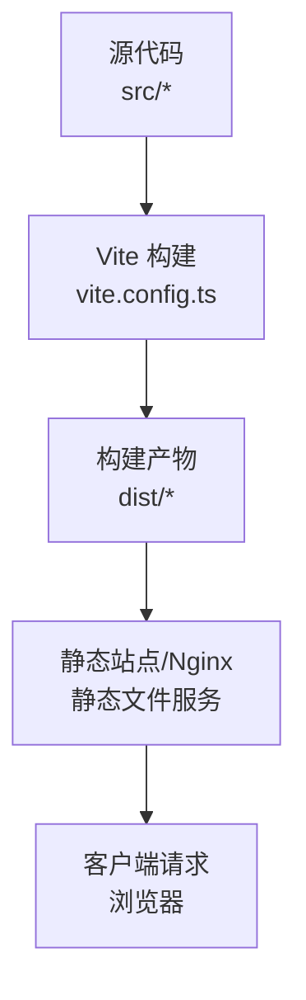
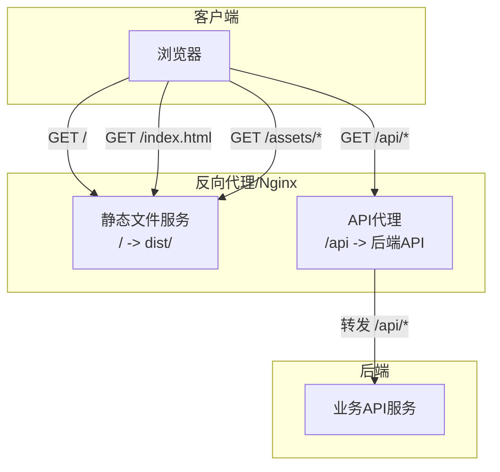
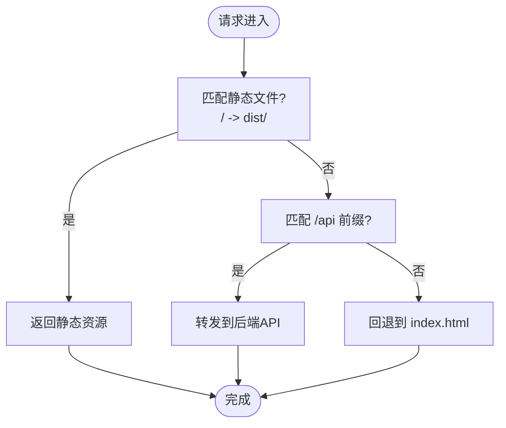

# 部署流程

<cite>
**本文引用的文件**
- [package.json](file://package.json)
- [vite.config.ts](file://vite.config.ts)
- [.env.production](file://.env.production)
- [.env.development](file://.env.development)
- [dist/index.html](file://dist/index.html)
- [index.html](file://index.html)
- [uno.config.ts](file://uno.config.ts)
- [README.md](file://README.md)
- [src/utils/request/request.ts](file://src/utils/request/request.ts)
- [src/router/index.ts](file://src/router/index.ts)
- [src/main.ts](file://src/main.ts)
</cite>

## 目录
1. [简介](#简介)
2. [项目结构](#项目结构)
3. [核心组件](#核心组件)
4. [架构总览](#架构总览)
5. [详细组件分析](#详细组件分析)
6. [依赖分析](#依赖分析)
7. [性能考虑](#性能考虑)
8. [故障排查指南](#故障排查指南)
9. [结论](#结论)
10. [附录](#附录)

## 简介
本指南面向LiFocus Web V2的部署与运维团队，覆盖从本地开发构建到生产环境部署的完整流程。内容包括：
- 本地构建与产物生成
- 静态资源准备与发布策略
- Nginx反向代理与静态文件服务配置要点
- CDN集成与缓存策略建议
- Docker容器化部署配置思路与最佳实践
- 自动化部署脚本与CI/CD流水线集成方法

## 项目结构
该仓库为基于Vue 3 + Vite的前端单页应用（SPA），采用Vite进行开发与打包，使用UnoCSS进行原子化样式管理。生产构建后输出静态资源至dist目录，入口HTML在dist/index.html中引用打包后的JS/CSS。

图表来源
- [vite.config.ts](file://vite.config.ts#L1-L31)
- [dist/index.html](file://dist/index.html#L1-L15)

章节来源
- [README.md](file://README.md#L26-L48)
- [vite.config.ts](file://vite.config.ts#L1-L31)
- [dist/index.html](file://dist/index.html#L1-L15)

## 核心组件
- 构建与开发服务器：Vite配置定义了插件、别名、开发服务器端口与API代理规则。
- 环境变量：通过.env文件区分开发与生产环境的基础API地址。
- 请求封装：统一的HTTP请求模块负责API前缀拼接与拦截器处理。
- 路由与入口：路由配置与应用入口负责SPA运行时的页面渲染与导航。
- 样式系统：UnoCSS配置集中管理主题色板与快捷类，确保构建一致性。

章节来源
- [vite.config.ts](file://vite.config.ts#L10-L30)
- [.env.development](file://.env.development#L1-L4)
- [.env.production](file://.env.production#L1-L2)
- [src/utils/request/request.ts](file://src/utils/request/request.ts)
- [src/router/index.ts](file://src/router/index.ts)
- [src/main.ts](file://src/main.ts)
- [uno.config.ts](file://uno.config.ts#L1-L50)

## 架构总览
下图展示了从浏览器到后端API的典型请求链路，以及静态资源在生产环境中的服务方式。

图表来源
- [vite.config.ts](file://vite.config.ts#L19-L29)
- [dist/index.html](file://dist/index.html#L8-L9)
- [.env.production](file://.env.production#L1-L2)

## 详细组件分析

### 本地构建与预览
- 开发模式：启动Vite开发服务器，默认端口由配置指定；内置代理用于转发/api前缀到后端。
- 生产构建：执行构建脚本生成dist目录下的静态资源；预览命令可本地验证产物。
- 类型检查：构建阶段包含类型检查步骤，确保TS类型安全。

章节来源
- [package.json](file://package.json#L9-L16)
- [vite.config.ts](file://vite.config.ts#L19-L30)
- [README.md](file://README.md#L32-L48)

### 环境变量与API基础路径
- 开发环境：API基础路径指向本地或相对路径，便于联调。
- 生产环境：API基础路径指向线上域名，确保生产请求正确路由。

章节来源
- [.env.development](file://.env.development#L1-L4)
- [.env.production](file://.env.production#L1-L2)

### 请求封装与API前缀
- 统一请求模块负责在运行时拼接基础API前缀与具体接口路径，支持拦截器扩展。
- 建议在生产环境通过环境变量注入基础路径，避免硬编码。

章节来源
- [src/utils/request/request.ts](file://src/utils/request/request.ts)

### SPA路由与入口
- 应用入口负责挂载根组件与初始化状态管理。
- 路由配置决定页面级导航与懒加载行为，生产环境需配合Nginx回退到index.html以支持前端路由。

章节来源
- [src/main.ts](file://src/main.ts)
- [src/router/index.ts](file://src/router/index.ts)

### 样式系统与主题
- UnoCSS集中管理颜色主题与常用快捷类，保证构建产物的一致性与体积可控。
- 构建后样式与脚本通过dist/index.html自动引入。

章节来源
- [uno.config.ts](file://uno.config.ts#L1-L50)
- [dist/index.html](file://dist/index.html#L8-L9)

### Nginx配置与反向代理
- 静态文件服务：将站点根目录映射到dist目录，确保所有静态资源可被访问。
- API代理：将/api前缀的请求转发到后端API服务，保持跨域与鉴权逻辑在后端处理。
- 前端路由回退：对未命中静态文件的路径回退到index.html，交由前端SPA处理路由。

图表来源
- [vite.config.ts](file://vite.config.ts#L19-L29)
- [dist/index.html](file://dist/index.html#L1-L15)

### CDN集成与缓存策略
- 资源分层：将静态资源（JS/CSS/媒体）部署至CDN，提升全球访问速度。
- 缓存策略建议：
  - JS/CSS：长缓存（如一年），文件名带哈希，版本升级时自动失效。
  - HTML：短缓存或不缓存，确保路由回退与动态内容即时生效。
  - 图片/媒体：按场景选择缓存时长，结合压缩与格式优化。
- 版本控制：通过构建产物命名与清单文件实现灰度与回滚。

（本节为通用实践说明，无需特定文件引用）

### Docker容器化部署
- 容器镜像：使用Nginx镜像作为静态Web服务器，将dist目录挂载到Nginx的站点根目录。
- 环境变量：通过环境变量注入基础API地址，避免在构建期写死。
- 健康检查：配置HTTP健康检查端点，保障容器可用性。
- 日志：将Nginx访问/错误日志输出到标准输出，便于集中收集。

（本节为通用实践说明，无需特定文件引用）

### 自动化部署与CI/CD
- 流水线阶段建议：
  - 安装依赖与缓存
  - 代码质量检查（ESLint/Prettier）
  - 类型检查与单元测试（如有）
  - 构建与产物校验
  - 部署到目标环境（Nginx/CDN）
- 触发条件：分支保护、标签发布、PR合并等。
- 回滚策略：蓝绿/金丝雀发布，保留上一版本镜像/资源以便快速回滚。

（本节为通用实践说明，无需特定文件引用）

## 依赖分析
- 构建工具链：Vite负责开发与打包，插件体系涵盖Vue、JSX、UnoCSS、SVG加载等。
- 运行时依赖：Vue 3、Vue Router、Pinia、Axios等，构成SPA运行基础。
- 开发依赖：TypeScript、ESLint、Prettier、Vue官方生态工具链。

图表来源
- [package.json](file://package.json#L18-L58)
- [vite.config.ts](file://vite.config.ts#L1-L31)

章节来源
- [package.json](file://package.json#L18-L58)
- [vite.config.ts](file://vite.config.ts#L1-L31)

## 性能考虑
- 资源压缩与分包：利用Vite默认的代码分割与压缩策略，减少首屏负载。
- 懒加载：路由与组件层面启用懒加载，降低初始包体。
- 缓存与CDN：静态资源长缓存，HTML短缓存，图片与媒体按需缓存。
- 预加载与预连接：对关键资源使用preload/模块图谱优化，合理设置DNS预连接。
- 监控与分析：接入性能监控，持续观察CLS/LCP/FID等指标。

（本节为通用实践说明，无需特定文件引用）

## 故障排查指南
- 构建失败
  - 检查Node版本是否满足引擎要求。
  - 清理依赖缓存后重试安装。
- 开发代理异常
  - 确认开发服务器代理配置与后端API可达性。
  - 校验代理rewrite规则与changeOrigin设置。
- 生产访问空白或路由404
  - 确认Nginx已将未命中静态资源的请求回退到index.html。
  - 检查基础API地址是否正确指向线上域名。
- 静态资源加载失败
  - 核对dist目录结构与Nginx根目录映射。
  - 检查CDN缓存是否生效或存在跨域问题。

章节来源
- [package.json](file://package.json#L6-L8)
- [vite.config.ts](file://vite.config.ts#L19-L29)
- [.env.production](file://.env.production#L1-L2)
- [dist/index.html](file://dist/index.html#L8-L9)

## 结论
通过规范化的构建流程、清晰的环境变量管理、合理的Nginx与CDN策略，以及可追溯的CI/CD流水线，LiFocus Web V2可在多环境下稳定交付。建议在生产环境中优先采用长缓存与版本化策略，结合健康检查与回滚机制，确保上线质量与用户体验。

## 附录
- 入口HTML与构建产物
  - 开发入口HTML位于根目录，生产入口HTML位于dist/index.html。
- 请求前缀与路由
  - 基础API前缀由环境变量注入，路由采用前端SPA模式，需配合Nginx回退。

章节来源
- [index.html](file://index.html#L1-L14)
- [dist/index.html](file://dist/index.html#L1-L15)
- [src/utils/request/request.ts](file://src/utils/request/request.ts)
- [src/router/index.ts](file://src/router/index.ts)