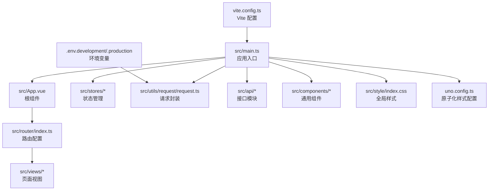
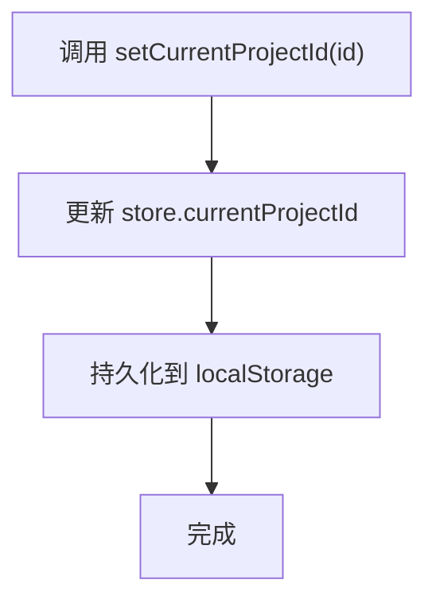
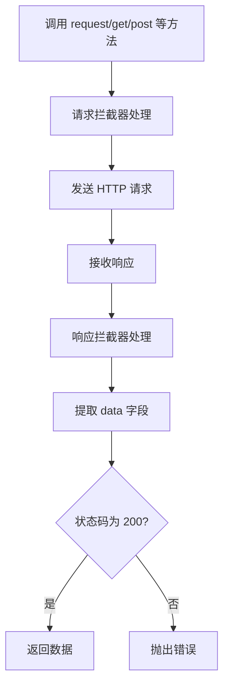

# 快速开始指南

<cite>
**本文引用的文件**
- [README.md](file://README.md)
- [package.json](file://package.json)
- [vite.config.ts](file://vite.config.ts)
- [.env.development](file://.env.development)
- [.env.production](file://.env.production)
- [eslint.config.ts](file://eslint.config.ts)
- [.prettierrc.json](file://.prettierrc.json)
- [tsconfig.json](file://tsconfig.json)
- [uno.config.ts](file://uno.config.ts)
- [src/main.ts](file://src/main.ts)
- [src/App.vue](file://src/App.vue)
- [src/router/index.ts](file://src/router/index.ts)
- [src/stores/main.ts](file://src/stores/main.ts)
- [src/utils/request/request.ts](file://src/utils/request/request.ts)
- [src/views/dashboard/index.vue](file://src/views/dashboard/index.vue)
- [src/views/auth/Login.vue](file://src/views/auth/Login.vue)
</cite>

## 更新摘要
**变更内容**
- 基于README.md提供的完整开发环境配置更新了环境搭建步骤
- 新增了详细的开发规范和命名规范说明
- 更新了项目启动流程和常用命令说明
- 补充了浏览器支持信息和开发环境配置详情

## 目录
1. [简介](#简介)
2. [功能特性](#功能特性)
3. [技术栈](#技术栈)
4. [项目结构](#项目结构)
5. [开发环境搭建](#开发环境搭建)
6. [开发规范](#开发规范)
7. [项目启动](#项目启动)
8. [常用命令](#常用命令)
9. [开发环境配置](#开发环境配置)
10. [项目结构详解](#项目结构详解)
11. [核心组件分析](#核心组件分析)
12. [依赖分析](#依赖分析)
13. [性能考虑](#性能考虑)
14. [故障排除指南](#故障排除指南)
15. [结论](#结论)
16. [附录](#附录)

## 简介
LiFocus Web V2 是一个专注于知识管理和内容创作的平台，帮助用户高效地组织、管理和分享知识内容。该项目基于 Vue 3 + Vite + TypeScript 技术栈，采用 Pinia 状态管理、UnoCSS 原子化样式、TDesign Vue Next 组件库与 Axios 请求封装，提供统一的 API 响应模型与开发体验。

## 功能特性
- **项目管理** - 创建和管理多个知识项目，按分类组织内容
- **文章管理** - 支持 Markdown 编辑的文章创作，支持笔记和文档两种类型
- **分类管理** - 树形结构的分类系统，灵活组织知识内容
- **文章分享** - 支持密码保护的文章分享功能，可生成分享链接
- **时间线** - 查看项目内容的更新历史和时间线
- **用户认证** - 安全的登录注册系统，支持 Token 认证

## 技术栈
- **前端框架** - Vue 3.5.26 (Composition API)
- **构建工具** - Vite 7.3.1
- **UI 组件库** - TDesign Vue Next
- **状态管理** - Pinia + pinia-plugin-persistedstate
- **样式方案** - UnoCSS (原子化 CSS)
- **Markdown 编辑器** - md-editor-v3
- **工具库** - VueUse、Day.js、Axios、Lodash
- **代码规范** - ESLint + Prettier + TypeScript

## 项目结构
项目采用"按功能域分层 + 组件化"的组织方式，核心目录与职责如下：
- src/api：后端接口模块（文章、认证、分类、项目、时间线）
- src/assets/images/svg：静态资源与 SVG 图标
- src/components：可复用业务组件（如自定义卡片、编辑器、项目卡片）
- src/hooks：自定义组合式逻辑（消息提示等）
- src/layout：布局组件（如项目布局）
- src/router：路由定义与导航
- src/stores：Pinia 状态仓库（计数器、主状态、用户）
- src/style：全局样式入口
- src/types：TypeScript 类型定义（API、文章、分类、登录、项目、时间线）
- src/utils：工具函数（枚举、请求封装、鉴权、项目相关）
- src/views：页面级视图（认证、仪表盘、项目、测试）



**图表来源**
- [src/main.ts](file://src/main.ts#L1-L28)
- [src/App.vue](file://src/App.vue#L1-L12)
- [src/router/index.ts](file://src/router/index.ts#L1-L90)
- [src/stores/main.ts](file://src/stores/main.ts#L1-L21)
- [src/utils/request/request.ts](file://src/utils/request/request.ts#L1-L99)
- [src/api/article.ts](file://src/api/article.ts)
- [src/components/CustomCard/index.vue](file://src/components/CustomCard/index.vue)
- [src/style/index.css](file://src/style/index.css)
- [uno.config.ts](file://uno.config.ts#L1-L50)
- [vite.config.ts](file://vite.config.ts#L1-L31)
- [.env.development](file://.env.development#L1-L4)
- [.env.production](file://.env.production#L1-L2)

**章节来源**
- [src/main.ts](file://src/main.ts#L1-L28)
- [src/router/index.ts](file://src/router/index.ts#L1-L90)
- [vite.config.ts](file://vite.config.ts#L1-L31)

## 开发环境搭建

### 环境要求
- **Node.js 版本**：^20.19.0 || >=22.12.0
- **包管理器**：推荐使用 pnpm（项目使用 pnpm install）
- **浏览器支持**：Chrome >= 88, Firefox >= 78, Safari >= 14, Edge >= 88

### 依赖安装
```bash
# 安装依赖
pnpm install
```

### 开发服务器启动
```bash
# 启动开发服务器
pnpm dev
```

### 生产构建
```bash
# 构建生产版本
pnpm build

# 预览生产构建
pnpm preview
```

**章节来源**
- [package.json](file://package.json#L6-L8)
- [README.md](file://README.md#L118-L164)

## 开发规范

### 代码规范
- 使用 **Composition API** 和 `<script setup>` 语法
- 组件名使用 **PascalCase**（如 `ArticleList.vue`）
- 组合式函数以 `use` 开头（如 `useTdMessage`）
- 类型定义文件使用 `.d.ts` 后缀
- 常量使用 **UPPER_SNAKE_CASE**

### 命名规范示例
```typescript
// 组件名
ArticleList.vue
CustomCard.vue

// 组合式函数
useClipboard()
useInfiniteScroll()

// 类型定义
interface IArticle {}
type TArticleType = 'NOTE' | 'DOC'

// 枚举
enum EArticleStatus {
  ACTIVE = 'ACTIVE',
  ARCHIVED = 'ARCHIVED'
}
```

**章节来源**
- [README.md](file://README.md#L84-L114)

## 项目启动

### 完整启动流程
```bash
# 1. 安装依赖
pnpm install

# 2. 启动开发服务器
pnpm dev

# 3. 在浏览器中访问 http://localhost:5173
```

### 项目启动验证
- 启动成功后，浏览器会自动打开 `http://localhost:5173`
- 开发服务器默认端口为 5173
- 修改代码后自动热重载

**章节来源**
- [README.md](file://README.md#L150-L164)
- [vite.config.ts](file://vite.config.ts#L19-L29)

## 常用命令

### 开发相关命令
```bash
# 启动开发服务器
pnpm dev

# 代码检查与修复
pnpm lint

# 代码格式化
pnpm format

# 类型检查
pnpm type-check
```

### 构建相关命令
```bash
# 生产构建
pnpm build

# 预览生产构建
pnpm preview

# 仅构建（不进行类型检查）
pnpm build-only
```

### 项目脚本说明
- **dev**：启动 Vite 开发服务器，支持热重载
- **build**：类型检查 + 编译打包
- **preview**：本地预览生产构建结果
- **build-only**：仅编译打包
- **type-check**：使用 vue-tsc 进行类型检查
- **lint**：ESLint 自动修复与缓存
- **format**：Prettier 批量格式化

**章节来源**
- [package.json](file://package.json#L9-L17)
- [README.md](file://README.md#L116-L136)

## 开发环境配置

### 环境变量配置
项目使用 Vite 的环境变量机制，支持开发和生产环境分离：

**开发环境 (.env.development)**
```bash
# VITE_BASE_API = http://localhost:5003/api
VITE_BASE_API = /api
```

**生产环境 (.env.production)**
```bash
VITE_BASE_API = http://118.25.79.223/api
```

### Vite 开发服务器配置
```typescript
// vite.config.ts
export default defineConfig({
  server: {
    port: 5173,
    proxy: {
      '/api': {
        target: 'http://0.0.0.0:5003',
        changeOrigin: true,
        rewrite: path => path.replace(/^\/api/, '/api'),
      },
    },
  },
})
```

### 代理配置说明
- **本地代理**：将 `/api` 前缀的请求转发到 `http://0.0.0.0:5003`
- **开发模式**：使用相对路径 `/api`，便于本地开发
- **生产模式**：使用完整域名，指向实际后端服务

**章节来源**
- [README.md](file://README.md#L138-L148)
- [vite.config.ts](file://vite.config.ts#L19-L29)
- [.env.development](file://.env.development#L1-L4)
- [.env.production](file://.env.production#L1-L2)

## 项目结构详解

### 目录组织
```
src/
├── api/                    # API 接口封装
├── assets/                 # 静态资源
├── components/             # 公共组件
├── constants/              # 常量定义
├── hooks/                  # 自定义组合式函数
├── layout/                 # 布局组件
├── router/                 # 路由配置
├── stores/                 # Pinia 状态管理
├── style/                  # 全局样式
├── types/                  # TypeScript 类型定义
├── utils/                  # 工具函数
└── views/                  # 页面视图
```

### 入口文件分析
**应用入口 (src/main.ts)**
- 注册 Vue 应用实例
- 配置 Pinia 状态管理（含持久化）
- 引入全局样式和第三方库
- 挂载应用到 DOM

**根组件 (src/App.vue)**
- 使用 RouterView 渲染当前路由视图
- 设置基础样式类名

**路由配置 (src/router/index.ts)**
- 认证路由：登录/注册页面
- 仪表盘路由：首页
- 项目路由：工作台、创建文章、对话框
- 分享路由：文章分享页面

**章节来源**
- [src/main.ts](file://src/main.ts#L1-L28)
- [src/App.vue](file://src/App.vue#L1-L12)
- [src/router/index.ts](file://src/router/index.ts#L1-L90)

## 核心组件分析

### 状态管理（Pinia）
主状态包含加载态与当前项目 ID，并通过持久化插件保存至 localStorage：



**图表来源**
- [src/stores/main.ts](file://src/stores/main.ts#L1-L21)

### 请求封装与拦截器
统一创建 Axios 实例，内置请求/响应拦截器：



**图表来源**
- [src/utils/request/request.ts](file://src/utils/request/request.ts#L1-L99)

### 全局样式与主题
- 引入 UnoCSS 原子化样式、重置样式与动画库
- 支持主题色板与快捷类名
- 在入口文件中注册全局样式与第三方库样式

**章节来源**
- [uno.config.ts](file://uno.config.ts#L1-L50)
- [src/main.ts](file://src/main.ts#L1-L28)

## 依赖分析

### 运行时依赖
- **Vue 3**：核心框架，版本 ^3.5.26
- **Vue Router**：路由管理，版本 ^4.6.4
- **Pinia**：状态管理，版本 ^3.0.4
- **Axios**：HTTP 客户端，版本 1.1.2
- **TDesign Vue Next**：UI 组件库，版本 ^1.17.7
- **UnoCSS**：原子化 CSS，版本 ^66.5.12
- **md-editor-v3**：Markdown 编辑器，版本 ^6.3.1

### 开发依赖
- **Vite**：构建工具，版本 ^7.3.0
- **TypeScript**：类型系统，版本 ~5.9.3
- **ESLint**：代码检查，版本 ^9.39.2
- **Prettier**：代码格式化，版本 3.7.4
- **Vue DevTools**：浏览器调试工具，版本 ^8.0.5

### 脚本命令
- **dev**：启动开发服务器
- **build**：生产构建
- **preview**：预览构建结果
- **build-only**：仅构建
- **type-check**：类型检查
- **lint**：代码检查
- **format**：代码格式化

**章节来源**
- [package.json](file://package.json#L18-L58)

## 性能考虑
- 使用动态导入实现路由级懒加载，减少首屏体积
- UnoCSS 按需生成样式，避免全量引入
- Pinia 持久化仅保存必要字段，降低存储开销
- 生产构建开启类型检查与最小化压缩，提升运行效率

## 故障排除指南

### 启动问题
- **Node.js 版本不匹配**：检查 package.json 中的 engines 字段
- **依赖安装失败**：尝试使用 pnpm 或清理 node_modules 后重新安装
- **端口被占用**：修改 vite.config.ts 中的 server.port

### API 请求问题
- **代理配置无效**：检查 .env.development 中的 VITE_BASE_API 设置
- **401 错误**：确认 Token 有效性，检查拦截器逻辑
- **跨域问题**：确认后端 CORS 配置

### 开发工具问题
- **ESLint 报错**：根据规则调整代码风格或忽略路径
- **Prettier 格式化问题**：检查 .prettierrc.json 配置
- **Vue DevTools 无法使用**：确保安装了浏览器扩展

**章节来源**
- [package.json](file://package.json#L6-L8)
- [vite.config.ts](file://vite.config.ts#L19-L29)
- [eslint.config.ts](file://eslint.config.ts#L10-L22)
- [src/utils/request/request.ts](file://src/utils/request/request.ts#L30-L38)

## 结论
通过本指南，你可以在本地快速搭建 LiFocus Web V2 的开发环境，理解项目结构与核心流程，并掌握常用命令与调试技巧。项目提供了完整的开发规范、环境配置和构建流程，建议在开发过程中结合 VS Code 推荐插件与 Vue DevTools 提升开发效率与调试体验。

## 附录

### IDE 配置建议
- **推荐编辑器**：VS Code
- **必备插件**：
  - Vue Official Extension（Volar）
  - ESLint
  - Prettier
  - Vue DevTools
- **开发建议**：
  - 启用 TypeScript 支持
  - 配置 ESLint 和 Prettier 自动格式化
  - 使用 Vue DevTools 调试组件状态

### 浏览器支持
- **Chrome**：>= 88
- **Firefox**：>= 78  
- **Safari**：>= 14
- **Edge**：>= 88

### 开发最佳实践
- 遵循项目制定的开发规范和命名约定
- 使用 Composition API 和 `<script setup>` 语法
- 合理使用 Pinia 进行状态管理
- 利用 UnoCSS 提高样式开发效率
- 定期运行代码检查和格式化命令

**章节来源**
- [README.md](file://README.md#L166-L172)
- [README.md](file://README.md#L84-L114)