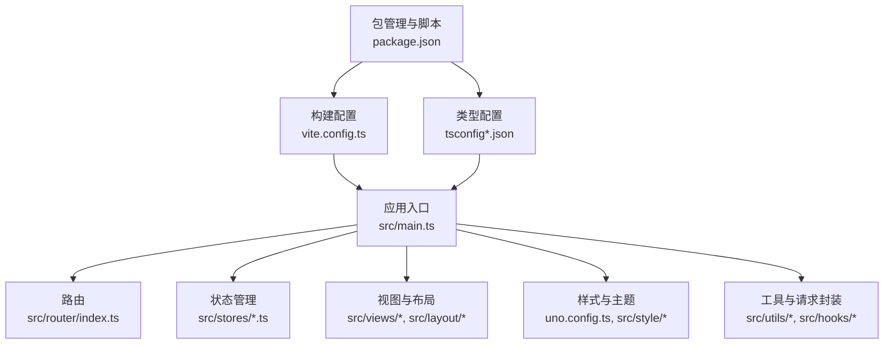
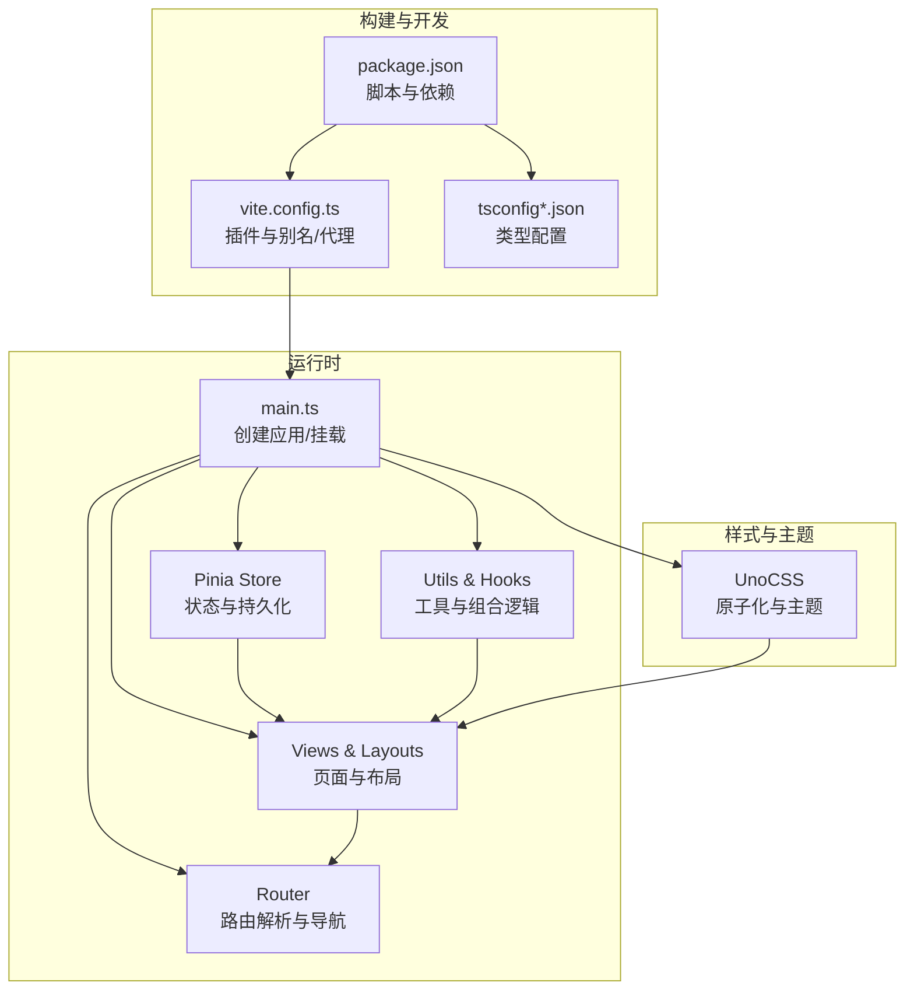
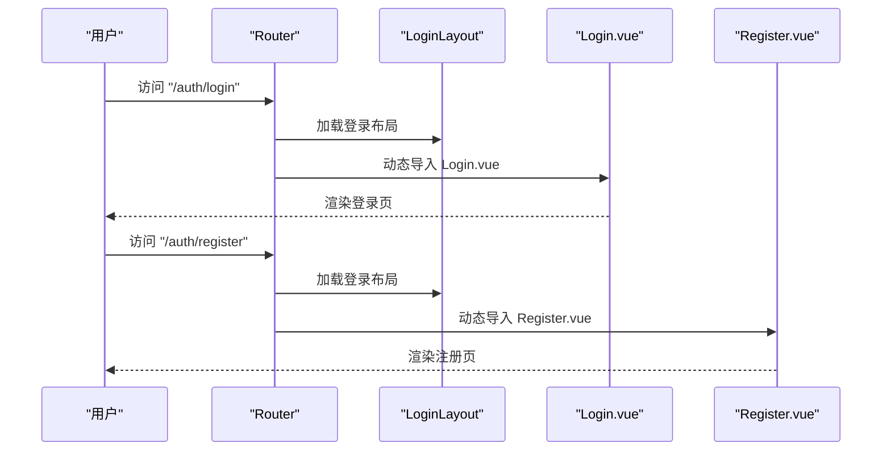
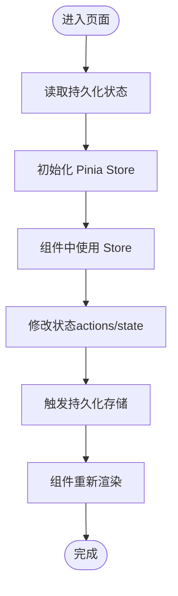
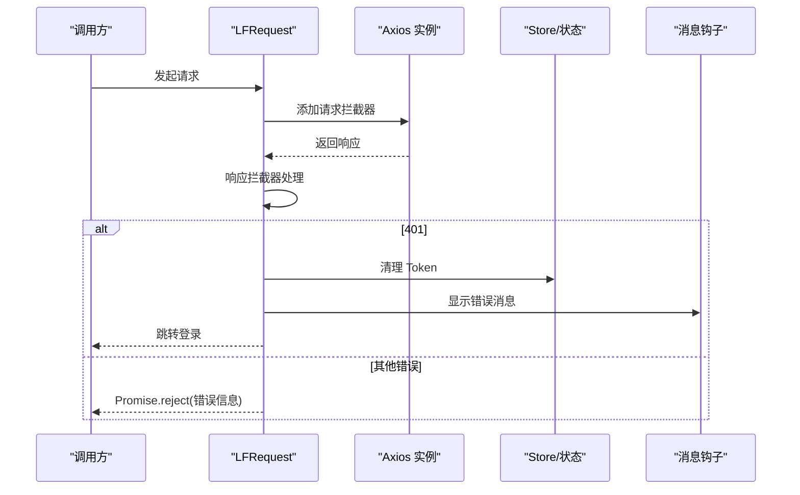
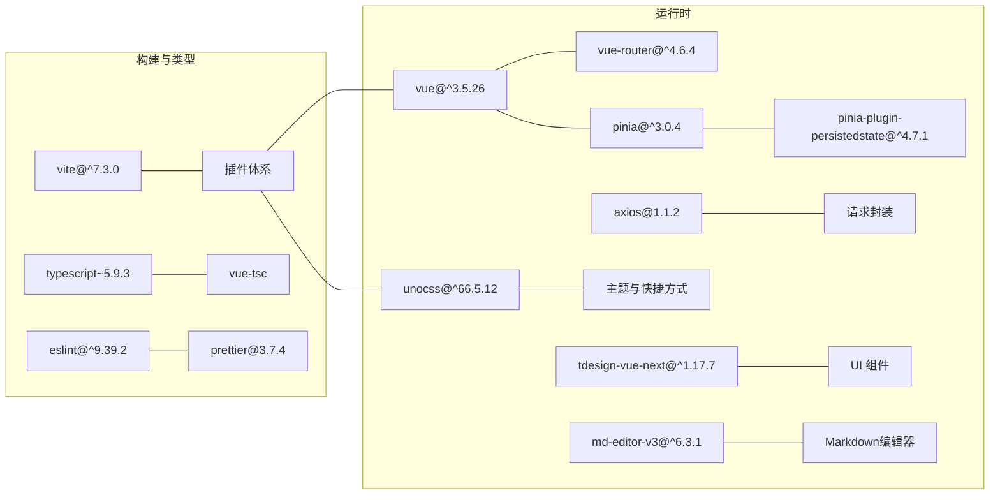

# 技术栈概览

<cite>
**本文引用的文件**
- [README.md](file://README.md)
- [package.json](file://package.json)
- [vite.config.ts](file://vite.config.ts)
- [uno.config.ts](file://uno.config.ts)
- [tsconfig.json](file://tsconfig.json)
- [tsconfig.app.json](file://tsconfig.app.json)
- [tsconfig.node.json](file://tsconfig.node.json)
- [src/main.ts](file://src/main.ts)
- [src/App.vue](file://src/App.vue)
- [src/router/index.ts](file://src/router/index.ts)
- [src/stores/main.ts](file://src/stores/main.ts)
- [src/stores/user.ts](file://src/stores/user.ts)
- [src/utils/request/request.ts](file://src/utils/request/request.ts)
- [src/hooks/useCustomMessage.ts](file://src/hooks/useCustomMessage.ts)
- [eslint.config.ts](file://eslint.config.ts)
</cite>

## 更新摘要
**所做更改**
- 更新了技术栈版本信息，包含Vue 3.5.26、Vite 7.3.1、TDesign Vue Next等具体版本号
- 补充了Markdown编辑器md-editor-v3的技术栈信息
- 完善了依赖分析中的版本兼容性信息
- 更新了学习路径与版本兼容性章节中的具体版本号

## 目录
1. [引言](#引言)
2. [项目结构](#项目结构)
3. [核心组件](#核心组件)
4. [架构总览](#架构总览)
5. [详细组件分析](#详细组件分析)
6. [依赖分析](#依赖分析)
7. [性能考虑](#性能考虑)
8. [故障排查指南](#故障排查指南)
9. [结论](#结论)
10. [附录：学习路径与版本兼容性](#附录学习路径与版本兼容性)

## 引言
本文件面向 LiFocus Web V2 项目，提供一份系统性的技术栈概览与实践说明。重点涵盖以下技术选型及其在项目中的定位与价值：
- 前端框架与构建：Vue 3.5.26、Vite 7.3.1
- 状态管理：Pinia（含持久化插件）
- 路由：Vue Router
- 类型系统：TypeScript
- 样式与原子化：UnoCSS
- UI组件库：TDesign Vue Next
- 工具与生态：Axios、Day.js、Lodash、md-editor-v3、VueUse、Animate.css、SimpleBar 等
- 开发体验与质量：ESLint、Prettier、Vue DevTools 插件、类型检查脚本

目标是帮助新成员快速理解技术栈选择的原因、在项目中的职责边界、以及如何高效地进行开发与维护。

## 项目结构
从仓库组织看，项目采用"功能域+层次化"的混合结构：
- 层次化：按职责分层（src/main.ts、router、stores、utils、hooks、components、views、style）
- 功能域：views 下划分 auth、dashboard、project 等业务域
- 配置集中：构建、类型、样式、环境变量等均在根目录下集中管理

**图表来源**
- [src/main.ts](file://src/main.ts#L1-L28)
- [src/router/index.ts](file://src/router/index.ts#L1-L90)
- [vite.config.ts](file://vite.config.ts#L1-L31)
- [tsconfig.json](file://tsconfig.json#L1-L12)

**章节来源**
- [package.json](file://package.json#L1-L60)
- [vite.config.ts](file://vite.config.ts#L1-L31)
- [tsconfig.json](file://tsconfig.json#L1-L12)

## 核心组件
- Vue 3.5.26：作为前端核心框架，提供响应式与组合式 API，支撑现代开发体验与高可维护性。
- Vite 7.3.1：构建工具与开发服务器，提供极快的冷启动与热更新，适配 Vue 3 生态。
- TypeScript：通过严格类型系统提升代码质量与协作效率，配合 vue-tsc 进行类型检查。
- Pinia：轻量级状态管理，支持模块化、TypeScript 友好、易于测试与持久化。
- Vue Router：单页应用路由，支持懒加载与嵌套路由，满足多视图与权限控制场景。
- UnoCSS：原子化 CSS 引擎，兼顾灵活性与体积控制，结合主题与快捷方式提升设计一致性。
- TDesign Vue Next：企业级 UI 组件库，提供丰富的业务组件与设计规范。
- Axios：HTTP 客户端，统一拦截器与错误处理，配合类型声明提升接口安全性。
- md-editor-v3：专业 Markdown 编辑器，支持实时预览与多种编辑模式。
- Day.js/Lodash：常用时间与工具函数库，保证跨浏览器与可复用性。
- VueUse：Vue 组合式工具集，提供丰富的组合式函数与工具方法。
- ESLint/Prettier：代码风格与质量保障，减少分歧，提升团队协作效率。

**章节来源**
- [src/main.ts](file://src/main.ts#L1-L28)
- [src/App.vue](file://src/App.vue#L1-L12)
- [src/router/index.ts](file://src/router/index.ts#L1-L90)
- [src/stores/main.ts](file://src/stores/main.ts#L1-L21)
- [src/stores/user.ts](file://src/stores/user.ts#L1-L29)
- [src/utils/request/request.ts](file://src/utils/request/request.ts#L1-L99)
- [uno.config.ts](file://uno.config.ts#L1-L50)
- [eslint.config.ts](file://eslint.config.ts#L1-L23)

## 架构总览
整体架构围绕"应用入口 -> 路由 -> 视图 -> 状态管理/工具"的数据流展开；样式通过 UnoCSS 提供原子化能力；构建与开发体验由 Vite 与相关插件保障。

**图表来源**
- [src/main.ts](file://src/main.ts#L1-L28)
- [src/router/index.ts](file://src/router/index.ts#L1-L90)
- [uno.config.ts](file://uno.config.ts#L1-L50)
- [vite.config.ts](file://vite.config.ts#L1-L31)
- [tsconfig.json](file://tsconfig.json#L1-L12)

## 详细组件分析

### Vue 3 与应用入口
- 应用创建与全局注册：在入口中创建应用实例，注册滚动条组件、Pinia、Router，并引入全局样式与动画。
- 组合式 API：App.vue 使用 script setup 与 RouterView 实现简洁的路由视图渲染。
- 价值：提供现代化开发体验、更好的逻辑复用与更清晰的生命周期管理。

**章节来源**
- [src/main.ts](file://src/main.ts#L1-L28)
- [src/App.vue](file://src/App.vue#L1-L12)

### Vue Router：路由设计与懒加载
- 路由结构：支持登录/注册子路由、仪表盘、项目域（工作台、对话框、创建文章）等。
- 懒加载：使用动态导入实现按需加载，降低首屏体积。
- 历史模式：基于浏览器历史记录的 WebHistory，结合 BASE_URL 使用。

**图表来源**
- [src/router/index.ts](file://src/router/index.ts#L1-L90)

**章节来源**
- [src/router/index.ts](file://src/router/index.ts#L1-L90)

### Pinia：状态管理与持久化
- 模块化：分别定义主状态与用户状态，职责清晰。
- 持久化：通过插件将状态写入 localStorage，实现刷新后恢复。
- 类型安全：结合 TypeScript 的 defineStore 与类型声明，确保状态结构稳定。

**图表来源**
- [src/stores/main.ts](file://src/stores/main.ts#L1-L21)
- [src/stores/user.ts](file://src/stores/user.ts#L1-L29)

**章节来源**
- [src/stores/main.ts](file://src/stores/main.ts#L1-L21)
- [src/stores/user.ts](file://src/stores/user.ts#L1-L29)

### UnoCSS：原子化样式与主题
- 快捷方式：定义常用类如文本溢出、居中等，提升开发效率。
- 主题颜色：集中管理主色、背景、字体色等，便于统一视觉风格。
- 与虚拟模块：通过 virtual:uno.css 在入口中按需引入，避免全局污染。

**章节来源**
- [uno.config.ts](file://uno.config.ts#L1-L50)
- [src/main.ts](file://src/main.ts#L10-L10)

### 请求封装与错误处理：Axios + 自定义 Hook
- 统一拦截器：封装请求/响应拦截，集中处理鉴权失效、错误提示与数据脱壳。
- 类型约束：通过泛型与类型声明，确保请求/响应结构可控。
- 错误反馈：结合自定义消息钩子，提供一致的用户反馈。

**图表来源**
- [src/utils/request/request.ts](file://src/utils/request/request.ts#L1-L99)
- [src/hooks/useCustomMessage.ts](file://src/hooks/useCustomMessage.ts#L1-L73)

**章节来源**
- [src/utils/request/request.ts](file://src/utils/request/request.ts#L1-L99)
- [src/hooks/useCustomMessage.ts](file://src/hooks/useCustomMessage.ts#L1-L73)

### 开发体验与质量：ESLint、Prettier、Vue DevTools
- ESLint：基于 @antfu/eslint-config，启用 TypeScript 支持并自定义规则。
- Prettier：统一格式化风格，减少代码风格分歧。
- Vue DevTools：Vite 插件提供调试面板，辅助开发与性能分析。

**章节来源**
- [eslint.config.ts](file://eslint.config.ts#L1-L23)
- [package.json](file://package.json#L40-L58)

## 依赖分析
- 运行时依赖：Vue 3.5.26、Vue Router、Pinia、Axios、Day.js、Lodash、TDesign Vue Next、md-editor-v3、Animate.css、SimpleBar、UnoCSS、VueUse 等。
- 开发依赖：Vite 7.3.1、TypeScript、vue-tsc、ESLint、Prettier、@vitejs/plugin-vue 等。
- 版本与兼容性：Node 引擎要求较高版本，构建与类型检查脚本明确；Vite 与 Vue 3 生态匹配良好。

**图表来源**
- [package.json](file://package.json#L18-L58)
- [vite.config.ts](file://vite.config.ts#L1-L31)

**章节来源**
- [package.json](file://package.json#L1-L60)
- [vite.config.ts](file://vite.config.ts#L1-L31)

## 性能考虑
- 构建与懒加载：Vite 7.3.1 提供快速冷启动与热更新；路由懒加载减少首屏资源。
- 样式体积：UnoCSS 原子化按需生成，避免全局样式冗余。
- 状态持久化：Pinia 持久化仅保留必要状态，避免内存膨胀。
- 请求拦截：统一处理错误与鉴权，减少无效重试与无意义渲染。
- 组件库：TDesign Vue Next 按需引入与 Tree-shaking，降低体积。
- Markdown编辑器：md-editor-v3 优化渲染性能，支持大文档编辑。

## 故障排查指南
- 构建失败或类型错误：执行类型检查脚本，定位 tsconfig 与类型声明问题。
- 路由跳转异常：检查路由别名与 BASE_URL，确认 history 模式与代理配置。
- 样式不生效：确认 UnoCSS 插件已启用，入口中引入了 virtual:uno.css。
- 请求 401：检查拦截器逻辑与 Token 清理流程，确认消息提示与跳转逻辑。
- 开发工具：开启 Vue DevTools 插件，利用状态树与组件面板定位问题。

**章节来源**
- [src/utils/request/request.ts](file://src/utils/request/request.ts#L31-L38)
- [vite.config.ts](file://vite.config.ts#L19-L29)
- [uno.config.ts](file://uno.config.ts#L1-L50)

## 结论
本项目以 Vue 3.5.26 为核心，结合 Vite 7.3.1、TypeScript、Pinia、Vue Router、UnoCSS、TDesign Vue Next 等技术，形成一套现代化、高性能且易维护的前端技术栈。通过模块化状态管理、原子化样式、统一请求封装与完善的开发工具链，有效提升了开发效率与用户体验。新增的 md-editor-v3 为 Markdown 编辑提供了专业解决方案，TDesign Vue Next 则确保了企业级 UI 的一致性与可用性。建议在后续迭代中持续关注生态演进与性能优化，保持技术栈的先进性与稳定性。

## 附录：学习路径与版本兼容性

### 学习路径建议
- Vue 3.5.26 基础：组合式 API、响应式原理、生命周期与指令
- Vite 7.3.1：插件体系、别名与代理、开发与生产配置
- TypeScript：基础类型、泛型、装饰器与声明合并
- Pinia：Store 设计、Actions/Mutations、持久化与测试
- Vue Router：路由配置、导航守卫、懒加载与嵌套路由
- UnoCSS：原子化理念、主题与快捷方式、与框架集成
- TDesign Vue Next：组件使用、主题定制、设计规范
- md-editor-v3：Markdown编辑、实时预览、扩展配置
- VueUse：组合式工具函数、浏览器API封装
- 工具与生态：Axios、Day.js、Lodash、ESLint、Prettier

### 版本与兼容性
- Node 引擎：^20.19.0 或 >=22.12.0
- Vue 3：^3.5.26
- Vue Router：^4.6.4
- Pinia：^3.0.4（含持久化插件 ^4.7.1）
- Vite：^7.3.0
- TypeScript：~5.9.3
- UnoCSS：^66.5.12
- TDesign Vue Next：^1.17.7
- md-editor-v3：^6.3.1
- VueUse：^14.2.0
- Day.js：^1.11.19
- Axios：1.1.2
- Lodash：^4.17.23
- ESLint：^9.39.2 与相关 Vue/TS 插件
- Prettier：3.7.4

**章节来源**
- [package.json](file://package.json#L6-L8)
- [package.json](file://package.json#L18-L58)
- [README.md](file://README.md#L16-L27)