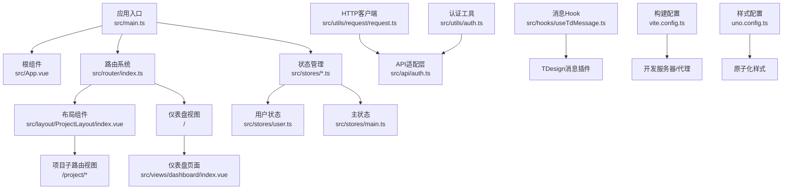
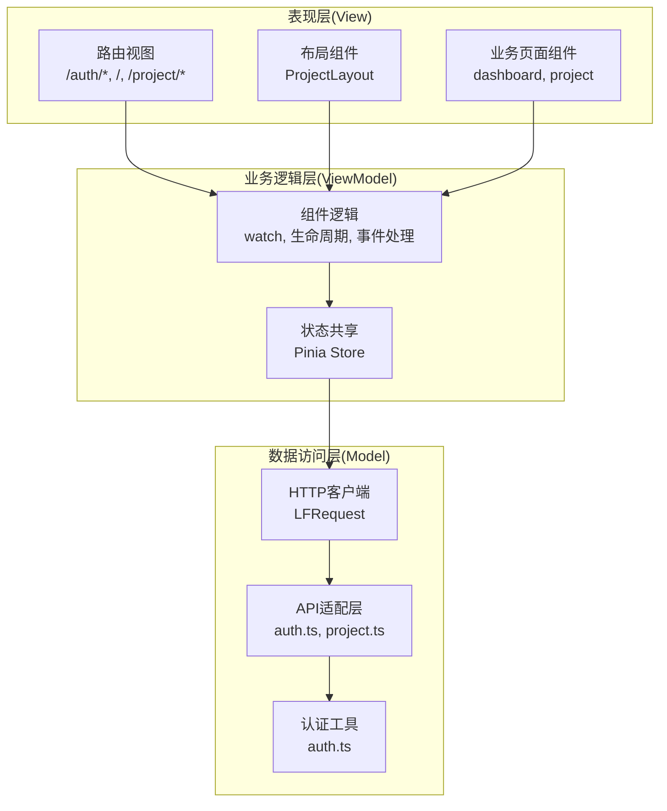
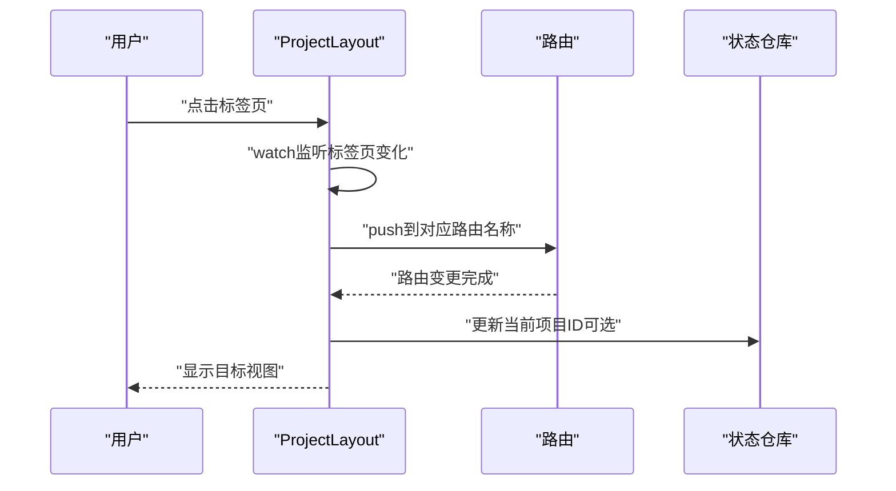
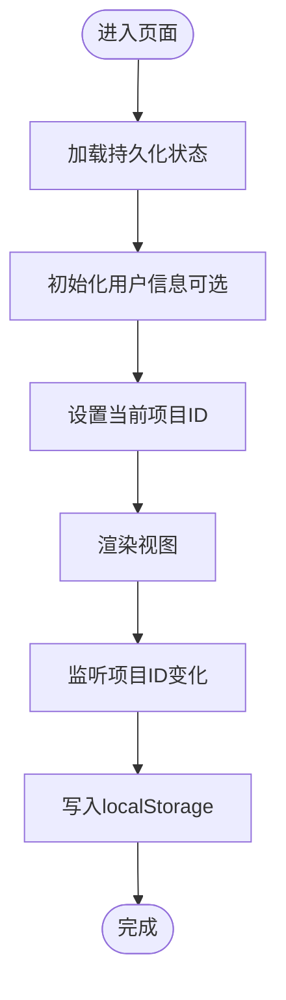
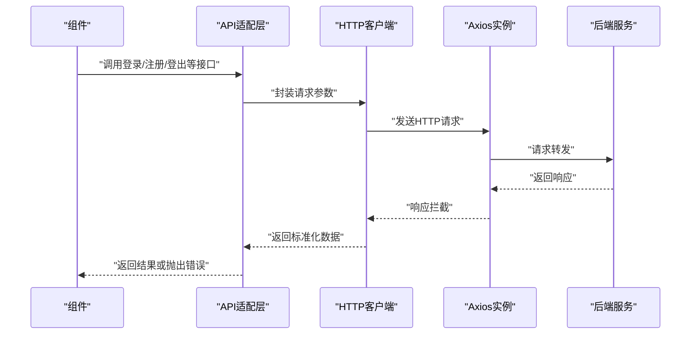
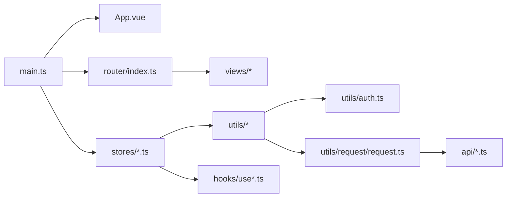

# 整体架构设计

<cite>
**本文档引用的文件**
- [src/main.ts](file://src/main.ts)
- [src/App.vue](file://src/App.vue)
- [src/router/index.ts](file://src/router/index.ts)
- [src/layout/ProjectLayout/index.vue](file://src/layout/ProjectLayout/index.vue)
- [src/views/dashboard/index.vue](file://src/views/dashboard/index.vue)
- [src/stores/main.ts](file://src/stores/main.ts)
- [src/stores/user.ts](file://src/stores/user.ts)
- [src/utils/request/request.ts](file://src/utils/request/request.ts)
- [src/api/auth.ts](file://src/api/auth.ts)
- [src/utils/auth.ts](file://src/utils/auth.ts)
- [src/hooks/useTdMessage.ts](file://src/hooks/useTdMessage.ts)
- [uno.config.ts](file://uno.config.ts)
- [vite.config.ts](file://vite.config.ts)
- [package.json](file://package.json)
</cite>

## 目录
1. [引言](#引言)
2. [项目结构](#项目结构)
3. [核心组件](#核心组件)
4. [架构总览](#架构总览)
5. [详细组件分析](#详细组件分析)
6. [依赖分析](#依赖分析)
7. [性能考虑](#性能考虑)
8. [故障排除指南](#故障排除指南)
9. [结论](#结论)
10. [附录](#附录)

## 引言
本文件面向LiFocus Web V2项目，提供整体架构设计文档。重点阐述前端应用的高层架构、模块划分与组件关系；解释MVVM架构在Vue 3中的应用（组件化设计、响应式数据流与状态管理）；说明分层架构（表现层、业务逻辑层、数据访问层）的职责划分；梳理路由系统、状态管理策略与组件通信机制；并给出架构图表与组件关系图，帮助开发者快速理解系统设计思路与未来扩展方向。

## 项目结构
项目采用基于功能域的组织方式，结合Vue 3单文件组件（SFC）与Pinia状态管理，配合Vite构建工具链与UnoCSS原子化样式方案。核心目录与职责如下：
- src/main.ts：应用入口，初始化Vue应用、挂载Pinia与路由，并引入全局样式与第三方组件库。
- src/App.vue：根组件，承载全局路由视图容器。
- src/router/index.ts：路由配置，定义认证、仪表盘、项目工作台等页面的路由与嵌套布局。
- src/layout/ProjectLayout/index.vue：项目相关页面的统一布局，包含顶部导航、项目选择、标签页切换与登出流程。
- src/views/dashboard/index.vue：仪表盘页面，采用网格布局组织左右侧栏与内容区域。
- src/stores/*：Pinia状态仓库，包含用户信息与主状态（如当前项目ID）。
- src/utils/request/request.ts：封装HTTP客户端，统一请求/响应拦截与错误处理。
- src/api/*：API适配层，封装具体接口调用（如登录、注册、登出、用户信息查询）。
- src/utils/auth.ts：认证令牌的存储与读取策略（Cookie与SessionStorage双通道）。
- src/hooks/useTdMessage.ts：消息提示Hook，封装TDesign消息插件的统一调用。
- uno.config.ts：UnoCSS配置，提供主题色与常用快捷类名。
- vite.config.ts：构建与开发服务器配置，含代理规则与插件集成。
- package.json：依赖与脚本定义。

**图表来源**
- [src/main.ts](file://src/main.ts#L1-L28)
- [src/App.vue](file://src/App.vue#L1-L12)
- [src/router/index.ts](file://src/router/index.ts#L1-L82)
- [src/layout/ProjectLayout/index.vue](file://src/layout/ProjectLayout/index.vue#L1-L135)
- [src/views/dashboard/index.vue](file://src/views/dashboard/index.vue#L1-L26)
- [src/stores/user.ts](file://src/stores/user.ts#L1-L29)
- [src/stores/main.ts](file://src/stores/main.ts#L1-L21)
- [src/utils/request/request.ts](file://src/utils/request/request.ts#L1-L99)
- [src/api/auth.ts](file://src/api/auth.ts#L1-L41)
- [src/utils/auth.ts](file://src/utils/auth.ts#L1-L71)
- [src/hooks/useTdMessage.ts](file://src/hooks/useTdMessage.ts#L1-L60)
- [vite.config.ts](file://vite.config.ts#L1-L31)
- [uno.config.ts](file://uno.config.ts#L1-L50)

**章节来源**
- [src/main.ts](file://src/main.ts#L1-L28)
- [src/App.vue](file://src/App.vue#L1-L12)
- [src/router/index.ts](file://src/router/index.ts#L1-L82)
- [vite.config.ts](file://vite.config.ts#L1-L31)
- [package.json](file://package.json#L1-L60)

## 核心组件
- 应用入口与初始化
  - 初始化Vue应用实例，注册滚动条组件、Pinia持久化插件、路由与全局样式。
  - 关键路径参考：[应用入口](file://src/main.ts#L17-L27)。
- 路由系统
  - 定义认证、仪表盘与项目工作台的路由与嵌套布局，支持动态导入视图组件。
  - 关键路径参考：[路由配置](file://src/router/index.ts#L5-L79)。
- 布局组件
  - 项目布局负责顶部导航、项目选择、标签页切换、用户信息弹窗与登出流程。
  - 关键路径参考：[项目布局](file://src/layout/ProjectLayout/index.vue#L1-L135)。
- 状态管理
  - 用户状态仓库用于拉取与缓存当前用户信息；主状态仓库维护加载态与当前项目ID，并持久化到localStorage。
  - 关键路径参考：[用户状态](file://src/stores/user.ts#L1-L29)、[主状态](file://src/stores/main.ts#L1-L21)。
- 数据访问层
  - HTTP客户端封装Axios，统一请求/响应拦截与错误处理；API适配层提供登录、注册、登出、用户信息查询等方法。
  - 关键路径参考：[HTTP客户端](file://src/utils/request/request.ts#L9-L96)、[认证API](file://src/api/auth.ts#L1-L41)。
- 认证工具
  - 提供设置、读取与移除访问令牌与刷新令牌的策略，支持“记住我”场景下的Cookie与SessionStorage双通道。
  - 关键路径参考：[认证工具](file://src/utils/auth.ts#L1-L71)。
- 消息提示Hook
  - 统一封装TDesign消息插件的success/error/warning/info方法，便于在组件中复用。
  - 关键路径参考：[消息Hook](file://src/hooks/useTdMessage.ts#L1-L60)。

**章节来源**
- [src/main.ts](file://src/main.ts#L1-L28)
- [src/router/index.ts](file://src/router/index.ts#L1-L82)
- [src/layout/ProjectLayout/index.vue](file://src/layout/ProjectLayout/index.vue#L1-L135)
- [src/stores/user.ts](file://src/stores/user.ts#L1-L29)
- [src/stores/main.ts](file://src/stores/main.ts#L1-L21)
- [src/utils/request/request.ts](file://src/utils/request/request.ts#L1-L99)
- [src/api/auth.ts](file://src/api/auth.ts#L1-L41)
- [src/utils/auth.ts](file://src/utils/auth.ts#L1-L71)
- [src/hooks/useTdMessage.ts](file://src/hooks/useTdMessage.ts#L1-L60)

## 架构总览
本项目采用MVVM架构在Vue 3中落地：
- Model：Pinia状态仓库（用户状态、主状态）与API适配层（封装后端接口），提供稳定的数据模型与数据访问能力。
- View：Vue单文件组件（SFC），通过模板语法绑定数据与事件，承担视图渲染与交互。
- ViewModel：通过Composition API与响应式系统（ref、reactive、computed、watch）实现组件逻辑与状态的解耦，配合Pinia进行跨组件状态共享。

分层架构职责划分：
- 表现层（View层）：路由视图、布局组件、业务页面组件（如仪表盘、项目工作台）。
- 业务逻辑层（ViewModel层）：组件内的逻辑处理、状态流转、事件回调与副作用（如watch监听、生命周期钩子）。
- 数据访问层（Model层）：HTTP客户端封装、API适配层、认证工具与类型定义。

路由系统设计要点：
- 使用vue-router的history模式与动态导入，减少首屏体积。
- 采用嵌套路由与布局组件（ProjectLayout）承载项目相关页面，提升复用性与一致性。
- 通过watch监听与编程式导航实现标签页与路由的双向同步。

状态管理策略：
- Pinia作为单一事实来源，结合pinia-plugin-persistedstate实现状态持久化（localStorage）。
- 主状态仓库集中管理全局状态（如加载态、当前项目ID），用户状态仓库负责用户信息的获取与缓存。

组件通信机制：
- 父子组件：通过props传递数据，通过事件（emit）向上反馈。
- 兄弟/跨层级：通过Pinia共享状态，避免深层传递与复杂事件冒泡。
- 路由级通信：通过路由参数与查询参数传递轻量数据，复杂数据使用Pinia。

**图表来源**
- [src/router/index.ts](file://src/router/index.ts#L1-L82)
- [src/layout/ProjectLayout/index.vue](file://src/layout/ProjectLayout/index.vue#L1-L135)
- [src/views/dashboard/index.vue](file://src/views/dashboard/index.vue#L1-L26)
- [src/stores/main.ts](file://src/stores/main.ts#L1-L21)
- [src/stores/user.ts](file://src/stores/user.ts#L1-L29)
- [src/utils/request/request.ts](file://src/utils/request/request.ts#L1-L99)
- [src/api/auth.ts](file://src/api/auth.ts#L1-L41)
- [src/utils/auth.ts](file://src/utils/auth.ts#L1-L71)

## 详细组件分析

### 路由系统与布局组件
- 路由配置
  - 认证路由组：登录、注册页面，使用LoginLayout作为父级布局。
  - 仪表盘路由：默认首页，展示仪表盘视图。
  - 项目路由组：以ProjectLayout为父级布局，包含对话框、工作台、创建文章等子路由。
  - 关键路径参考：[路由配置](file://src/router/index.ts#L5-L79)。
- 布局组件
  - 顶部区域包含Logo、项目选择下拉、用户信息弹窗与登出按钮。
  - 中部标签页（对话、工作台、创建）通过watch与编程式导航实现与路由的联动。
  - 在mounted阶段根据当前路由名称初始化标签页状态，并拉取项目列表。
  - 关键路径参考：[项目布局](file://src/layout/ProjectLayout/index.vue#L57-L72)、[标签页切换](file://src/layout/ProjectLayout/index.vue#L30-L42)、[登出流程](file://src/layout/ProjectLayout/index.vue#L44-L51)。

**图表来源**
- [src/layout/ProjectLayout/index.vue](file://src/layout/ProjectLayout/index.vue#L30-L42)
- [src/router/index.ts](file://src/router/index.ts#L47-L72)

**章节来源**
- [src/router/index.ts](file://src/router/index.ts#L1-L82)
- [src/layout/ProjectLayout/index.vue](file://src/layout/ProjectLayout/index.vue#L1-L135)

### 状态管理与持久化
- 用户状态仓库
  - 通过getCurrentUser动作异步获取用户信息并写入store，便于全局展示昵称、头像等。
  - 关键路径参考：[用户状态](file://src/stores/user.ts#L11-L20)。
- 主状态仓库
  - 维护isLoading与currentProjectId，并通过setCurrentProjectId同时更新localStorage中的项目ID。
  - 关键路径参考：[主状态](file://src/stores/main.ts#L10-L19)。
- 持久化策略
  - 通过pinia-plugin-persistedstate将store持久化至localStorage，确保刷新后状态不丢失。
  - 关键路径参考：[入口初始化](file://src/main.ts#L22-L24)、[持久化配置](file://src/stores/main.ts#L16-L20)。

**图表来源**
- [src/stores/main.ts](file://src/stores/main.ts#L10-L19)
- [src/stores/user.ts](file://src/stores/user.ts#L11-L20)
- [src/main.ts](file://src/main.ts#L22-L24)

**章节来源**
- [src/stores/main.ts](file://src/stores/main.ts#L1-L21)
- [src/stores/user.ts](file://src/stores/user.ts#L1-L29)
- [src/main.ts](file://src/main.ts#L1-L28)

### 数据访问层与错误处理
- HTTP客户端封装
  - 基于Axios创建实例，统一添加请求/响应拦截器；对401未授权自动清理token并跳转登录页；对非200错误统一reject并返回错误信息。
  - 支持自定义拦截器注入，满足特定请求的前置/后置处理。
  - 关键路径参考：[HTTP客户端](file://src/utils/request/request.ts#L17-L50)、[请求方法封装](file://src/utils/request/request.ts#L55-L95)。
- API适配层
  - 将具体接口抽象为函数（如loginApi、registerApi、logoutApi、getCurrentUserApi），统一使用httpClient发起请求。
  - 关键路径参考：[认证API](file://src/api/auth.ts#L7-L40)。
- 认证工具
  - 提供setToken/getToken/getRefreshToken/removeToken，支持“记住我”场景下的Cookie与SessionStorage双通道。
  - 关键路径参考：[认证工具](file://src/utils/auth.ts#L12-L70)。

**图表来源**
- [src/api/auth.ts](file://src/api/auth.ts#L1-L41)
- [src/utils/request/request.ts](file://src/utils/request/request.ts#L17-L50)

**章节来源**
- [src/utils/request/request.ts](file://src/utils/request/request.ts#L1-L99)
- [src/api/auth.ts](file://src/api/auth.ts#L1-L41)
- [src/utils/auth.ts](file://src/utils/auth.ts#L1-L71)

### 组件通信与消息提示
- 组件间通信
  - 通过props与emit实现父子通信；通过Pinia共享状态实现跨组件通信；通过路由参数传递轻量数据。
  - 关键路径参考：[布局组件中的状态与路由联动](file://src/layout/ProjectLayout/index.vue#L23-L42)。
- 消息提示
  - 通过useTdMessage封装统一的消息提示，支持success/error/warning/info四种类型。
  - 关键路径参考：[消息Hook](file://src/hooks/useTdMessage.ts#L4-L58)。

**章节来源**
- [src/layout/ProjectLayout/index.vue](file://src/layout/ProjectLayout/index.vue#L1-L135)
- [src/hooks/useTdMessage.ts](file://src/hooks/useTdMessage.ts#L1-L60)

## 依赖分析
- 外部依赖概览
  - Vue 3、Vue Router、Pinia、Axios、tdesign-vue-next、unocss、vite等。
  - 关键路径参考：[依赖声明](file://package.json#L18-L39)。
- 内部模块依赖
  - main.ts依赖App.vue、router、stores与全局样式；router依赖各视图组件；layout依赖stores与api；stores依赖utils与api；utils依赖hooks与auth。
  - 关键路径参考：[入口依赖](file://src/main.ts#L1-L16)、[路由依赖](file://src/router/index.ts#L1-L2)、[布局依赖](file://src/layout/ProjectLayout/index.vue#L1-L19)。

**图表来源**
- [src/main.ts](file://src/main.ts#L1-L28)
- [src/router/index.ts](file://src/router/index.ts#L1-L82)
- [src/layout/ProjectLayout/index.vue](file://src/layout/ProjectLayout/index.vue#L1-L19)
- [src/stores/main.ts](file://src/stores/main.ts#L1-L21)
- [src/stores/user.ts](file://src/stores/user.ts#L1-L29)
- [src/utils/request/request.ts](file://src/utils/request/request.ts#L1-L99)
- [src/api/auth.ts](file://src/api/auth.ts#L1-L41)
- [src/utils/auth.ts](file://src/utils/auth.ts#L1-L71)
- [src/hooks/useTdMessage.ts](file://src/hooks/useTdMessage.ts#L1-L60)

**章节来源**
- [package.json](file://package.json#L1-L60)
- [src/main.ts](file://src/main.ts#L1-L28)
- [src/router/index.ts](file://src/router/index.ts#L1-L82)

## 性能考虑
- 代码分割与懒加载
  - 路由视图采用动态导入，减少首屏包体，提升初始加载速度。
  - 关键路径参考：[路由动态导入](file://src/router/index.ts#L20-L71)。
- 构建与代理
  - Vite配置启用开发代理，将/api前缀请求转发至后端服务，便于本地联调。
  - 关键路径参考：[开发代理](file://vite.config.ts#L21-L27)。
- 样式与主题
  - UnoCSS提供原子化样式与主题色配置，减少重复样式编写，提升样式维护效率。
  - 关键路径参考：[UnoCSS配置](file://uno.config.ts#L10-L48)。
- 状态持久化
  - Pinia持久化仅保存必要字段，避免大对象频繁序列化带来的性能损耗。
  - 关键路径参考：[持久化配置](file://src/stores/main.ts#L16-L20)。

[本节为通用性能建议，无需特定文件分析]

## 故障排除指南
- 登录状态异常
  - 当HTTP响应为401时，HTTP客户端会清除token并提示错误，随后跳转登录页。
  - 关键路径参考：[401处理](file://src/utils/request/request.ts#L31-L38)。
- 错误信息统一提示
  - 使用useTdMessage封装错误消息，便于在组件中统一展示。
  - 关键路径参考：[错误消息提示](file://src/hooks/useTdMessage.ts#L19-L31)。
- Token管理
  - “记住我”场景下，访问令牌与刷新令牌分别存储于Cookie与SessionStorage，需确保同源一致。
  - 关键路径参考：[Token存储策略](file://src/utils/auth.ts#L12-L45)。

**章节来源**
- [src/utils/request/request.ts](file://src/utils/request/request.ts#L31-L38)
- [src/hooks/useTdMessage.ts](file://src/hooks/useTdMessage.ts#L19-L31)
- [src/utils/auth.ts](file://src/utils/auth.ts#L12-L45)

## 结论
LiFocus Web V2项目以Vue 3为核心，结合Pinia实现清晰的状态管理，通过路由系统与布局组件实现良好的页面组织与复用。数据访问层采用统一的HTTP客户端与API适配层，配合认证工具与消息提示Hook，形成从视图到数据的完整链路。整体架构具备良好的可维护性与扩展性，适合后续按功能域持续演进。

## 附录
- 开发与构建
  - 开发命令、构建命令与类型检查脚本见package.json scripts。
  - 关键路径参考：[脚本定义](file://package.json#L9-L16)。
- 样式与主题
  - UnoCSS主题色与快捷类名配置，便于统一视觉风格。
  - 关键路径参考：[UnoCSS主题](file://uno.config.ts#L10-L48)。

**章节来源**
- [package.json](file://package.json#L9-L16)
- [uno.config.ts](file://uno.config.ts#L10-L48)