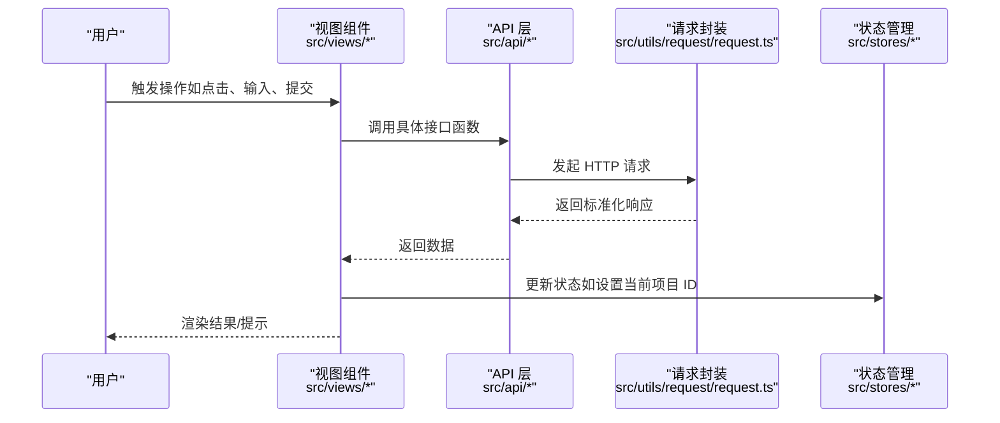
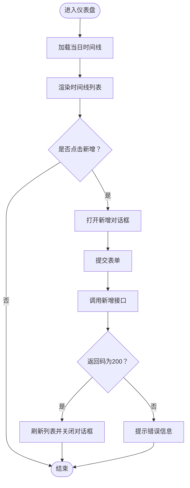
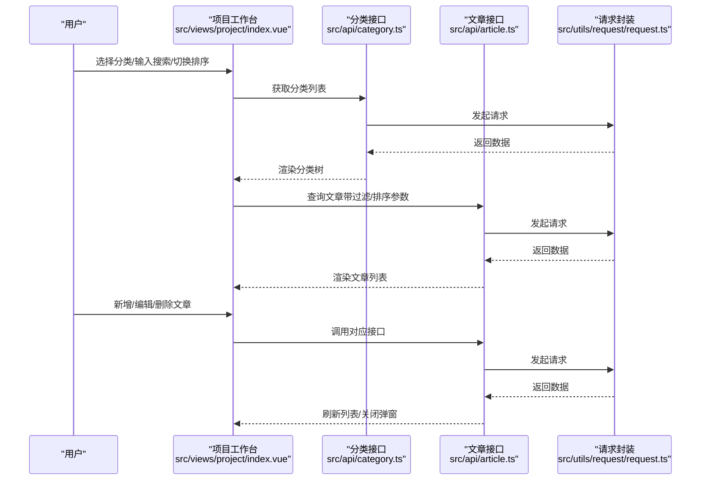
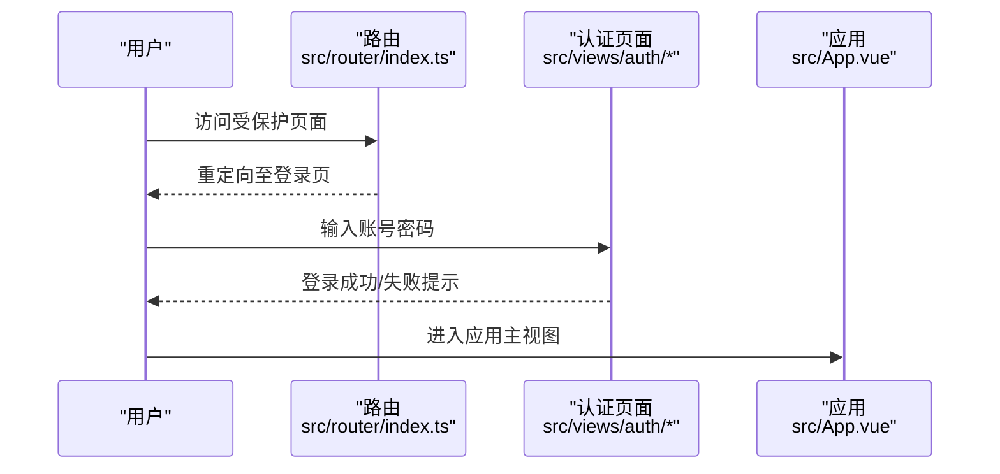
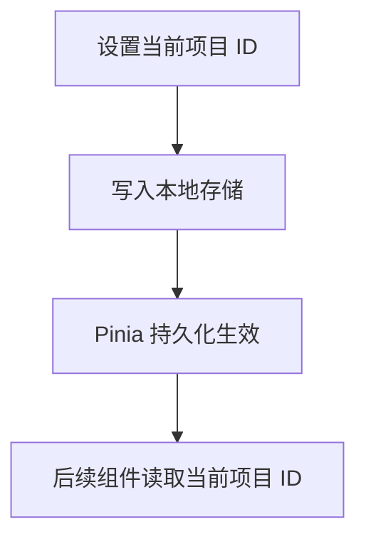
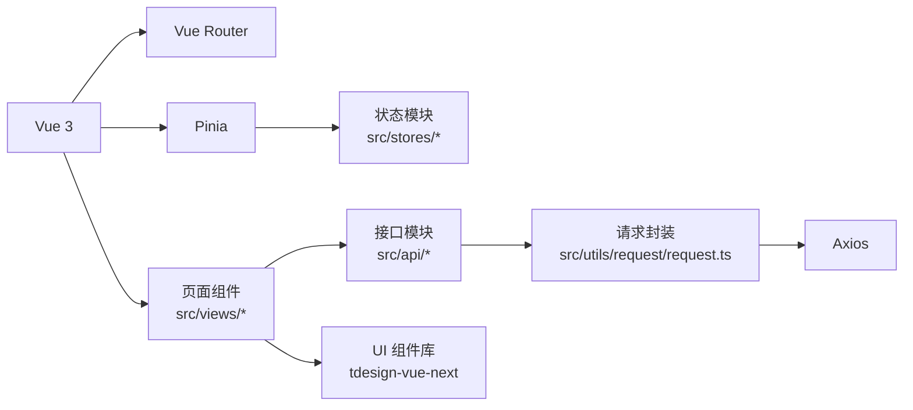

# 项目介绍与目标

<cite>
**本文档引用的文件**
- [README.md](file://README.md)
- [package.json](file://package.json)
- [src/main.ts](file://src/main.ts)
- [src/App.vue](file://src/App.vue)
- [src/router/index.ts](file://src/router/index.ts)
- [src/stores/main.ts](file://src/stores/main.ts)
- [src/utils/request/request.ts](file://src/utils/request/request.ts)
- [src/api/project.ts](file://src/api/project.ts)
- [src/api/article.ts](file://src/api/article.ts)
- [src/views/dashboard/index.vue](file://src/views/dashboard/index.vue)
- [src/views/dashboard/components/time-line.vue](file://src/views/dashboard/components/time-line.vue)
- [src/views/project/index.vue](file://src/views/project/index.vue)
- [src/types/apiTypes.d.ts](file://src/types/apiTypes.d.ts)
- [src/types/articleTypes.d.ts](file://src/types/articleTypes.d.ts)
- [src/types/projectTypes.d.ts](file://src/types/projectTypes.d.ts)
- [src/types/categoryTypes.d.ts](file://src/types/categoryTypes.d.ts)
- [src/types/timelineTypes.d.ts](file://src/types/timelineTypes.d.ts)
- [src/utils/enums/timelineEnum.ts](file://src/utils/enums/timelineEnum.ts)
</cite>

## 更新摘要
**所做更改**
- 更新了项目简介部分，整合了README.md中的功能特性和技术栈信息
- 完善了项目结构说明，增加了新的组件和工具模块
- 新增了开发规范和命名约定章节
- 更新了技术栈详情，包含具体的版本信息
- 增强了功能特性的描述，涵盖文章分享和时间线管理
- 完善了浏览器兼容性信息

## 目录
1. [简介](#简介)
2. [功能特性](#功能特性)
3. [技术栈](#技术栈)
4. [项目结构](#项目结构)
5. [开发规范](#开发规范)
6. [核心组件](#核心组件)
7. [架构总览](#架构总览)
8. [详细组件分析](#详细组件分析)
9. [依赖关系分析](#依赖关系分析)
10. [性能考虑](#性能考虑)
11. [故障排查指南](#故障排查指南)
12. [结论](#结论)
13. [附录](#附录)

## 简介
LiFocus Web V2 是一个专注于知识管理和内容创作的协作型平台，基于 Vue 3 + Vite 构建。该平台旨在帮助用户高效地组织、管理和分享知识内容，通过"项目+内容+时间线"三位一体的工作流，为个人和团队提供完整的知识管理体系。

### 核心目标与愿景
- **知识管理**：通过清晰的项目视图与内容组织，降低信息碎片化带来的协作成本
- **内容创作**：提供直观的 Markdown 编辑器和多维排序检索，提升知识资产的可发现性与复用率
- **进度追踪**：通过时间线模块提供每日/阶段性回顾与提醒，增强个人和团队的执行力
- **协作分享**：支持密码保护的文章分享功能，促进知识的跨团队传播

### 目标用户群体
- **项目经理与产品负责人**：用于项目概览与进度管理
- **内容创作者与知识工作者**：用于文章/笔记的组织与沉淀
- **团队成员**：在统一平台上完成日常记录与协作
- **教育工作者**：用于课程资料和学习笔记的管理

### 业务价值与技术价值
- **业务价值**：提升团队协作效率、沉淀知识资产、增强项目透明度、促进知识共享
- **技术价值**：采用现代化前端栈（Vue 3 + Vite + TypeScript）、模块化路由与状态管理、统一请求封装与错误处理，具备良好的扩展性与可维护性

**章节来源**
- [README.md](file://README.md#L1-L172)
- [package.json](file://package.json#L1-L60)

## 功能特性
LiFocus Web V2 提供了完整的内容管理解决方案，涵盖项目管理、内容创作、时间线跟踪和用户协作等核心功能：

### 项目管理
- 创建和管理多个知识项目，按分类组织内容
- 支持项目筛选与排序，追踪近期更新
- 项目状态管理（ACTIVE/ARCHIVED）

### 内容创作
- 支持 Markdown 编辑的文章创作
- 支持笔记和文档两种类型（NOTE/DAILY）
- 文章的增删改查操作
- 分类树管理与多维排序检索

### 分类管理
- 树形结构的分类系统
- 灵活组织知识内容
- 支持添加/编辑/删除分类节点

### 文章分享
- 支持密码保护的文章分享功能
- 可生成安全的分享链接
- 支持分享状态的管理

### 时间线管理
- 查看项目内容的更新历史和时间线
- 支持多种时间线类型（工作、生活、学习等）
- 状态可视化（进行中、已暂停、已完成）

### 用户认证
- 安全的登录注册系统
- 支持 Token 认证
- 路由守卫与鉴权提示

**章节来源**
- [README.md](file://README.md#L5-L12)
- [src/api/project.ts](file://src/api/project.ts#L1-L38)
- [src/api/article.ts](file://src/api/article.ts#L1-L75)
- [src/types/articleTypes.d.ts](file://src/types/articleTypes.d.ts#L1-L65)
- [src/types/timelineTypes.d.ts](file://src/types/timelineTypes.d.ts#L1-L39)

## 技术栈
LiFocus Web V2 采用了现代化的前端技术栈，确保项目的高性能和可维护性：

### 前端框架
- **Vue 3.5.26** - Composition API + `<script setup>` 语法
- **Vue Router 4.6.4** - 现代化路由管理
- **Pinia 3.0.4** + pinia-plugin-persistedstate - 状态管理与持久化

### 构建工具
- **Vite 7.3.1** - 快速的开发服务器和构建工具
- **TypeScript 5.9.3** - 类型安全的 JavaScript 超集

### UI 组件库
- **TDesign Vue Next 1.17.7** - 企业级 UI 组件库
- **UnoCSS 66.5.12** - 原子化 CSS 框架

### 编辑器与工具
- **md-editor-v3 6.3.1** - 功能强大的 Markdown 编辑器
- **VueUse 14.2.0** - Vue 组合式工具集
- **Day.js 1.11.19** - 轻量级日期处理库
- **Axios 1.1.2** - HTTP 客户端
- **Lodash 4.17.23** - 实用工具函数库

### 代码规范
- **ESLint + Prettier** - 代码质量和风格统一
- **Vue DevTools** - 开发调试工具

**章节来源**
- [README.md](file://README.md#L14-L27)
- [package.json](file://package.json#L18-L58)

## 项目结构
该项目采用"按功能域划分"的前端工程化组织方式，核心目录与职责如下：

### 核心目录结构
```
src/
├── api/                    # API 接口封装（项目、文章、分类、时间线）
├── assets/                 # 静态资源（图片、SVG 图标）
├── components/             # 公共组件（自定义卡片、编辑器、项目卡片）
├── constants/              # 常量定义
├── hooks/                  # 自定义组合式函数（消息提示等）
├── layout/                 # 布局组件（项目页面布局）
├── router/                 # 路由配置
├── stores/                 # Pinia 状态管理（计数器、主状态、用户状态）
├── style/                  # 全局样式（颜色、通用、基础样式）
├── types/                  # TypeScript 类型定义
├── utils/                  # 工具函数（枚举、请求封装、鉴权、项目工具）
└── views/                  # 页面视图（认证、仪表板、项目、分享、测试）
```

### 开发工具与配置
- **开发环境**：.env.development 和 .env.production 配置文件
- **构建配置**：vite.config.ts 和 uno.config.ts
- **类型检查**：tsconfig.json 和各种 tsconfig.* 配置文件
- **代码规范**：eslint.config.ts 和 .prettierrc.json

**章节来源**
- [README.md](file://README.md#L29-L82)
- [src/router/index.ts](file://src/router/index.ts#L1-L90)

## 开发规范
为了保持代码的一致性和可维护性，项目制定了严格的开发规范：

### 代码规范
- 使用 **Composition API** 和 `<script setup>` 语法
- 组件名使用 **PascalCase**（如 `ArticleList.vue`）
- 组合式函数以 `use` 开头（如 `useTdMessage`）
- 类型定义文件使用 `.d.ts` 后缀
- 常量使用 **UPPER_SNAKE_CASE**

### 命名规范示例
```typescript
// 组件名
ArticleList.vue
CustomCard.vue

// 组合式函数
useClipboard()
useInfiniteScroll()

// 类型定义
interface IArticle {}
type TArticleType = 'NOTE' | 'DOC'

// 枚举
enum EArticleStatus {
  ACTIVE = 'ACTIVE',
  ARCHIVED = 'ARCHIVED'
}
```

### 提交规范
```bash
# 安装依赖
pnpm install

# 启动开发服务器
pnpm dev

# 代码检查与修复
pnpm lint

# 代码格式化
pnpm format

# 类型检查
pnpm type-check

# 生产构建
pnpm build
```

**章节来源**
- [README.md](file://README.md#L84-L136)

## 核心组件
### 应用入口与初始化
在应用入口中完成组件库样式引入、滚动条组件注册、Pinia 初始化与持久化插件注入、路由挂载等步骤，确保全局可用性与状态持久化。

### 路由与页面
路由包含认证（登录/注册）、仪表盘、项目工作台等页面；项目工作台进一步细分为对话框、工作台、创建文章等子路由。

### 状态管理
主状态包含加载态与当前项目 ID，并通过 Pinia 持久化到本地存储，保证刷新后仍可保留关键上下文。

### 请求封装
自定义 HTTP 客户端封装，统一处理请求/响应拦截器、错误提示与 401 登录态失效跳转，提供 get/post/put/delete 等方法。

**章节来源**
- [src/main.ts](file://src/main.ts#L1-L28)
- [src/router/index.ts](file://src/router/index.ts#L1-L90)
- [src/stores/main.ts](file://src/stores/main.ts#L1-L21)
- [src/utils/request/request.ts](file://src/utils/request/request.ts#L1-L99)

## 架构总览
下图展示了从用户操作到数据流转的关键路径：页面组件触发 API 调用，经统一请求封装处理后返回数据，再由组件渲染或更新状态。



**图表来源**
- [src/views/dashboard/index.vue](file://src/views/dashboard/index.vue#L1-L26)
- [src/views/project/index.vue](file://src/views/project/index.vue#L1-L371)
- [src/api/project.ts](file://src/api/project.ts#L1-L38)
- [src/api/article.ts](file://src/api/article.ts#L1-L75)
- [src/utils/request/request.ts](file://src/utils/request/request.ts#L1-L99)
- [src/stores/main.ts](file://src/stores/main.ts#L1-L21)

## 详细组件分析

### 仪表盘（Dashboard）
#### 功能概述
- 左侧为导航/快捷入口，右侧为内容区域，整体采用栅格布局，支持左右分区展示
- 时间线组件提供按日查看与新增条目的能力，配合表单校验与消息反馈

#### 数据流
- 组件通过 API 获取当日时间线列表，映射为时间线选项并渲染；新增时调用接口并刷新列表

#### 错误处理
- 表单校验失败时提示；接口调用失败时统一错误提示；空数据时显示占位图与文案



**图表来源**
- [src/views/dashboard/components/time-line.vue](file://src/views/dashboard/components/time-line.vue#L1-L151)

**章节来源**
- [src/views/dashboard/index.vue](file://src/views/dashboard/index.vue#L1-L26)
- [src/views/dashboard/components/time-line.vue](file://src/views/dashboard/components/time-line.vue#L1-L151)

### 项目工作台（Project Workspace）
#### 功能概述
- 分类树管理：支持添加/编辑/删除分类节点，树形激活项变化时联动文章列表
- 文章列表：支持按标题搜索、按更新/创建时间/标题排序，支持新增/编辑/查看文章
- 文章表单：以弹窗形式承载新增/编辑/查看三种模式，支持关闭回调刷新列表

#### 数据流
- 通过分类树获取分类列表，选择节点后调用文章接口分页获取文章；排序与搜索参数随请求下发；新增/编辑/删除后刷新列表

#### 错误处理
- 对空输入、权限不足、网络异常等情况进行统一提示；401 时清理本地令牌并跳转登录页



**图表来源**
- [src/views/project/index.vue](file://src/views/project/index.vue#L1-L371)
- [src/api/article.ts](file://src/api/article.ts#L1-L75)
- [src/utils/request/request.ts](file://src/utils/request/request.ts#L1-L99)

**章节来源**
- [src/views/project/index.vue](file://src/views/project/index.vue#L1-L371)
- [src/api/article.ts](file://src/api/article.ts#L1-L75)
- [src/utils/request/request.ts](file://src/utils/request/request.ts#L1-L99)

### 认证与路由
#### 路由设计
- 认证路由组包含登录与注册页面；仪表盘与项目工作台为受保护页面；路由懒加载按需加载组件

#### 认证流程
- 登录成功后进入仪表盘；若 401，统一清理令牌并跳转登录页，同时提示登录状态异常



**图表来源**
- [src/router/index.ts](file://src/router/index.ts#L1-L90)
- [src/App.vue](file://src/App.vue#L1-L12)
- [src/utils/request/request.ts](file://src/utils/request/request.ts#L30-L38)

**章节来源**
- [src/router/index.ts](file://src/router/index.ts#L1-L90)
- [src/App.vue](file://src/App.vue#L1-L12)
- [src/utils/request/request.ts](file://src/utils/request/request.ts#L30-L38)

### 状态管理与持久化
#### 主状态
- 包含加载态与当前项目 ID；提供设置当前项目 ID 的动作，并同步写入本地存储

#### 持久化策略
- 使用 Pinia 插件持久化到 localStorage，确保刷新后状态不丢失



**图表来源**
- [src/stores/main.ts](file://src/stores/main.ts#L1-L21)

**章节来源**
- [src/stores/main.ts](file://src/stores/main.ts#L1-L21)

## 依赖关系分析
### 技术栈
- **前端框架**：Vue 3、Vue Router、Pinia
- **UI 组件库**：tdesign-vue-next
- **工具库**：axios、dayjs、lodash、js-cookie
- **构建与开发**：Vite、TypeScript、UnoCSS、ESLint、Prettier

### 外部依赖与集成点
- **HTTP 客户端**：统一通过请求封装模块进行调用，便于集中处理拦截器与错误
- **UI 组件**：基于 tdesign-vue-next，提供丰富的表单、弹窗、时间线等组件

### 潜在耦合与优化
- 页面与 API 层耦合度低，通过类型定义强约束接口契约，利于演进
- 可进一步抽象通用 CRUD 模板与分页组件，减少重复代码



**图表来源**
- [package.json](file://package.json#L18-L58)
- [src/main.ts](file://src/main.ts#L1-L28)
- [src/router/index.ts](file://src/router/index.ts#L1-L90)
- [src/stores/main.ts](file://src/stores/main.ts#L1-L21)
- [src/api/project.ts](file://src/api/project.ts#L1-L38)
- [src/api/article.ts](file://src/api/article.ts#L1-L75)
- [src/utils/request/request.ts](file://src/utils/request/request.ts#L1-L99)

**章节来源**
- [package.json](file://package.json#L18-L58)
- [src/main.ts](file://src/main.ts#L1-L28)
- [src/router/index.ts](file://src/router/index.ts#L1-L90)
- [src/stores/main.ts](file://src/stores/main.ts#L1-L21)
- [src/api/project.ts](file://src/api/project.ts#L1-L38)
- [src/api/article.ts](file://src/api/article.ts#L1-L75)
- [src/utils/request/request.ts](file://src/utils/request/request.ts#L1-L99)

## 性能考虑
- **路由懒加载**：通过动态导入实现按需加载，减少首屏体积
- **组件懒加载**：页面内组件按需加载，避免不必要的资源消耗
- **状态持久化**：Pinia 持久化减少刷新后的重复请求
- **请求拦截**：统一错误处理与登录态失效跳转，避免无效重试
- **UI 组件**：使用虚拟滚动与简单布局，减少 DOM 重排与重绘

## 故障排查指南
### 登录态异常
- **现象**：出现 401 并被强制跳转登录页
- **处理**：检查本地令牌是否过期或被清除；确认后端接口返回状态与消息

### 接口报错
- **现象**：接口返回非 200 或业务错误
- **处理**：查看控制台错误信息与响应体；根据提示修复参数或权限

### 页面空白或组件不显示
- **现象**：路由切换后页面空白
- **处理**：确认路由配置与组件导出；检查组件是否正确注册

### 时间线为空
- **现象**：日期无数据
- **处理**：确认日期范围参数与后端时间格式；检查是否有数据

**章节来源**
- [src/utils/request/request.ts](file://src/utils/request/request.ts#L30-L38)
- [src/views/dashboard/components/time-line.vue](file://src/views/dashboard/components/time-line.vue#L71-L86)

## 结论
LiFocus Web V2 以"项目+内容+时间线"为核心，构建了面向协作与知识沉淀的前端平台。通过清晰的模块划分、统一的类型约束与请求封装，以及现代化的技术栈，项目在可维护性与扩展性方面具备良好基础。

### 未来演进方向
- 完善权限体系与审计日志
- 扩展时间线类型与统计维度
- 增强文章编辑器与协作评论能力
- 引入缓存策略与离线能力
- 支持多语言和主题定制

## 附录
### 快速开始
```bash
# 安装依赖
pnpm install

# 开发运行
pnpm dev

# 生产构建
pnpm build

# 预览生产版本
pnpm preview

# 代码检查
pnpm lint

# 代码格式化
pnpm format

# 类型检查
pnpm type-check
```

### 开发环境配置
- **Node.js 版本要求**：^20.19.0 或 >=22.12.0
- **浏览器支持**：Chrome >= 88, Firefox >= 78, Safari >= 14, Edge >= 88
- **环境变量**：VITE_BASE_API 配置 API 基础地址

### 版本与许可证
- **当前版本**：0.0.0（私有仓库）
- **许可证**：未在仓库中声明（私有项目）
- **社区支持**：未在仓库中声明（私有项目）

**章节来源**
- [README.md](file://README.md#L138-L172)
- [package.json](file://package.json#L6-L8)