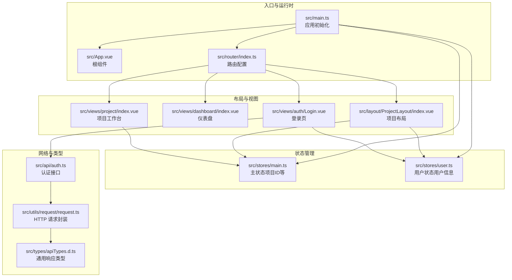
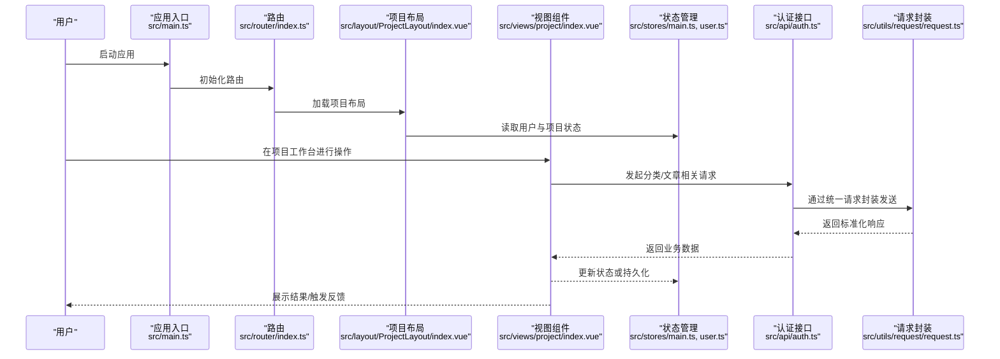
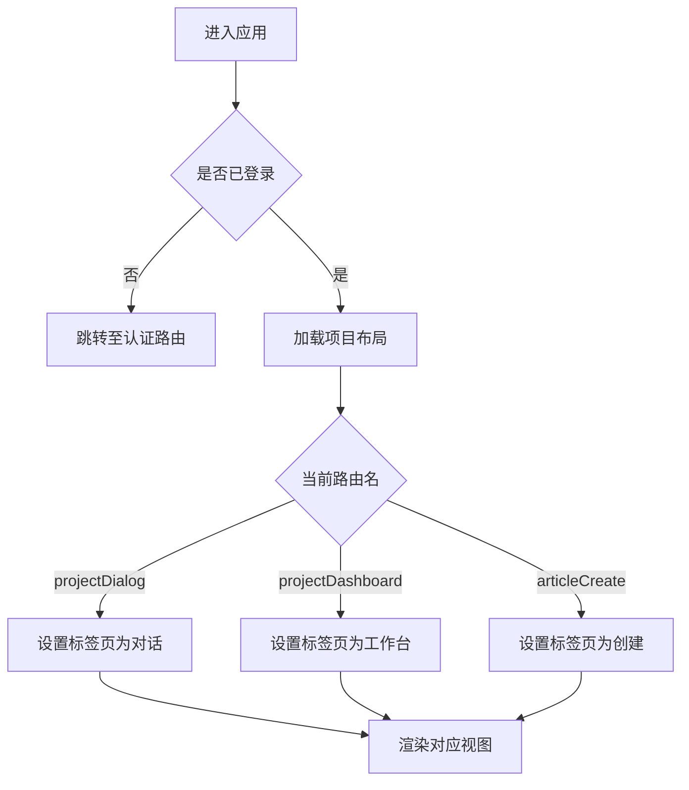
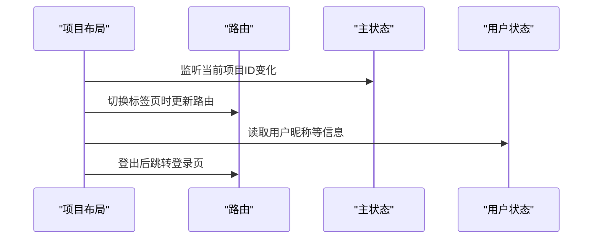
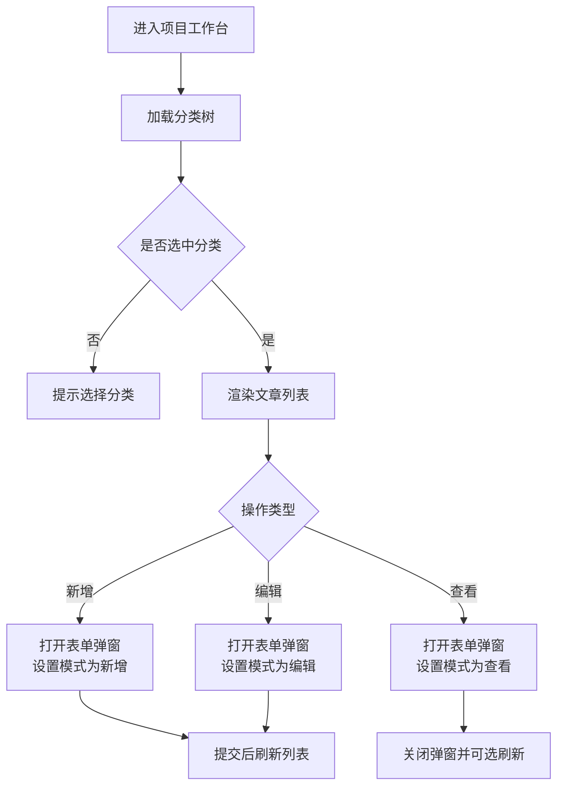
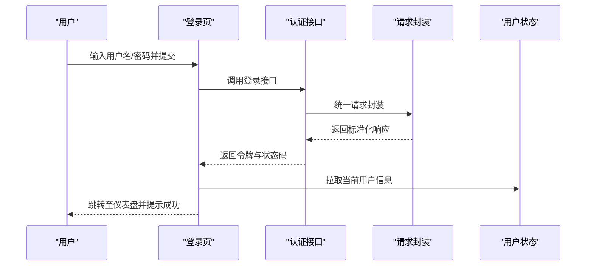
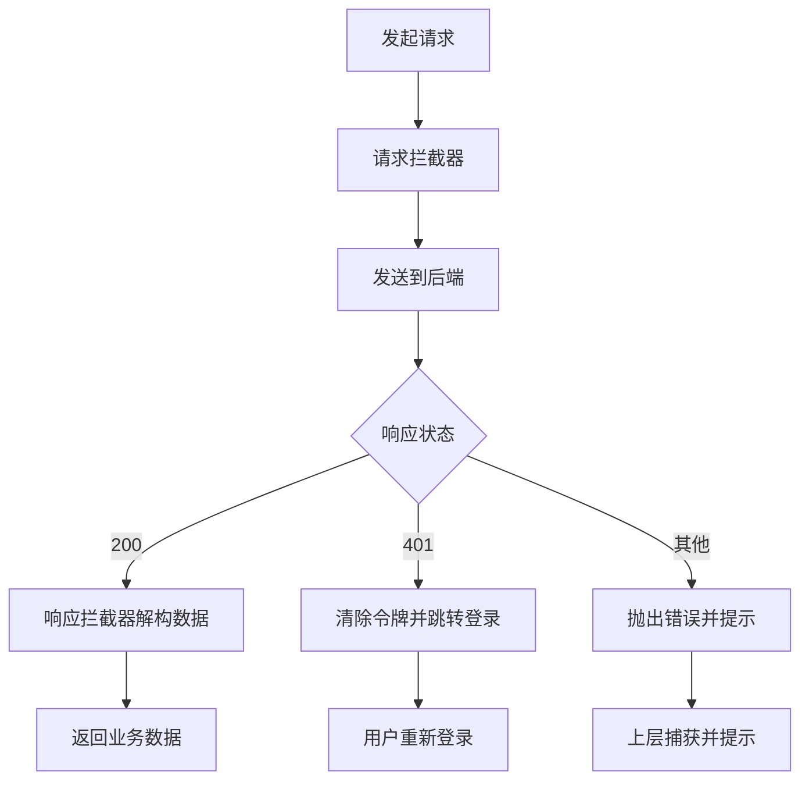
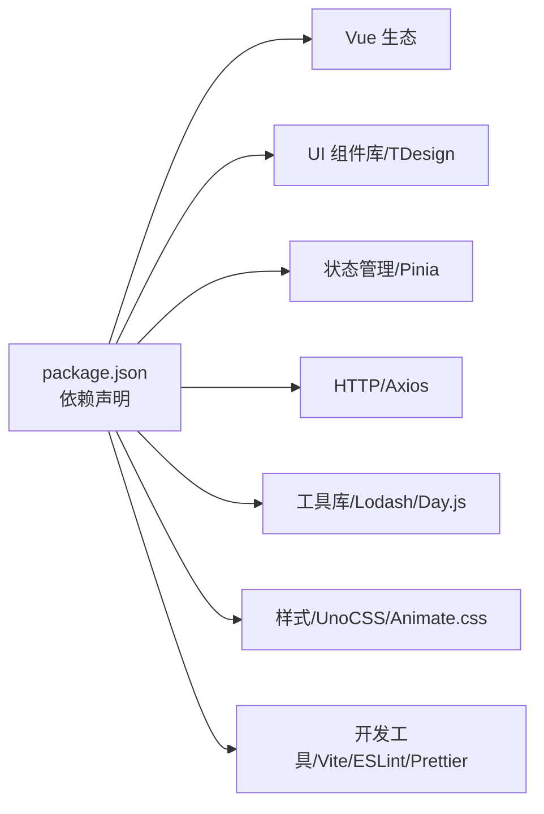

# 项目概述

<cite>
**本文引用的文件**
- [README.md](file://README.md)
- [package.json](file://package.json)
- [vite.config.ts](file://vite.config.ts)
- [src/main.ts](file://src/main.ts)
- [src/App.vue](file://src/App.vue)
- [src/router/index.ts](file://src/router/index.ts)
- [src/stores/main.ts](file://src/stores/main.ts)
- [src/stores/user.ts](file://src/stores/user.ts)
- [src/layout/ProjectLayout/index.vue](file://src/layout/ProjectLayout/index.vue)
- [src/views/dashboard/index.vue](file://src/views/dashboard/index.vue)
- [src/views/project/index.vue](file://src/views/project/index.vue)
- [src/views/auth/Login.vue](file://src/views/auth/Login.vue)
- [src/api/auth.ts](file://src/api/auth.ts)
- [src/utils/request/request.ts](file://src/utils/request/request.ts)
- [src/types/apiTypes.d.ts](file://src/types/apiTypes.d.ts)
</cite>

## 目录
1. [引言](#引言)
2. [项目结构](#项目结构)
3. [核心组件](#核心组件)
4. [架构总览](#架构总览)
5. [详细组件分析](#详细组件分析)
6. [依赖分析](#依赖分析)
7. [性能考虑](#性能考虑)
8. [故障排除指南](#故障排除指南)
9. [结论](#结论)
10. [附录：快速开始](#附录快速开始)

## 引言
LiFocus Web V2 是一个基于 Vue 3 的现代化前端应用，专注于知识管理和内容创作。项目采用 TypeScript、Pinia、Vue Router、Vite 等现代前端技术栈，结合 UnoCSS、TDesign 组件库与图标体系，构建可扩展、可维护的单页应用（SPA）。其设计理念强调：
- 清晰的路由分层与布局组织（认证、仪表盘、项目工作台）
- 以 Pinia 实现的状态管理与持久化
- 以 API 抽象为核心的网络层设计
- 可复用的组件与工具模块

## 项目结构
项目采用按功能域划分的目录组织方式，核心目录与职责如下：
- src/api：后端接口封装，按领域拆分（认证、项目、文章、分类、时间线）
- src/components：可复用基础组件（如自定义卡片、编辑器、项目卡片）
- src/hooks：组合式工具（消息提示、自定义消息等）
- src/layout：页面级布局（如项目布局）
- src/router：路由配置与懒加载
- src/stores：Pinia 状态管理（主状态、用户状态）
- src/types：TypeScript 类型定义（API、文章、分类、登录、项目、时间线）
- src/utils：工具模块（枚举、HTTP 请求封装、鉴权、项目工具）
- src/views：页面视图（认证、仪表盘、项目工作台、测试页）

**图表来源**
- [src/main.ts](file://src/main.ts#L1-L28)
- [src/App.vue](file://src/App.vue#L1-L12)
- [src/router/index.ts](file://src/router/index.ts#L1-L90)
- [src/stores/main.ts](file://src/stores/main.ts#L1-L21)
- [src/stores/user.ts](file://src/stores/user.ts#L1-L29)
- [src/layout/ProjectLayout/index.vue](file://src/layout/ProjectLayout/index.vue#L1-L135)
- [src/views/dashboard/index.vue](file://src/views/dashboard/index.vue#L1-L26)
- [src/views/project/index.vue](file://src/views/project/index.vue#L1-L371)
- [src/views/auth/Login.vue](file://src/views/auth/Login.vue#L1-L138)
- [src/api/auth.ts](file://src/api/auth.ts#L1-L41)
- [src/utils/request/request.ts](file://src/utils/request/request.ts#L1-L99)
- [src/types/apiTypes.d.ts](file://src/types/apiTypes.d.ts#L1-L7)

**章节来源**
- [README.md](file://README.md#L29-L82)
- [package.json](file://package.json#L1-L60)
- [vite.config.ts](file://vite.config.ts#L1-L31)

## 核心组件
- 应用入口与运行时
  - 应用通过入口文件创建并挂载，引入路由、Pinia、全局样式与组件注册，完成初始化。
  - 路由采用 History 模式，支持嵌套路由与动态导入。
- 状态管理
  - 主状态用于保存当前项目 ID，并持久化到本地存储；用户状态用于保存用户信息并拉取当前用户。
- 布局与视图
  - 项目布局提供顶部导航、项目选择、标签页切换与登出能力；仪表盘与项目工作台分别承载左右分区与内容管理。
- 网络层
  - 以统一的请求封装类实现请求/响应拦截，处理 401 重定向、错误提示与通用响应解构。

**章节来源**
- [src/main.ts](file://src/main.ts#L1-L28)
- [src/router/index.ts](file://src/router/index.ts#L1-L90)
- [src/stores/main.ts](file://src/stores/main.ts#L1-L21)
- [src/stores/user.ts](file://src/stores/user.ts#L1-L29)
- [src/layout/ProjectLayout/index.vue](file://src/layout/ProjectLayout/index.vue#L1-L135)
- [src/views/dashboard/index.vue](file://src/views/dashboard/index.vue#L1-L26)
- [src/views/project/index.vue](file://src/views/project/index.vue#L1-L371)
- [src/api/auth.ts](file://src/api/auth.ts#L1-L41)
- [src/utils/request/request.ts](file://src/utils/request/request.ts#L1-L99)

## 架构总览
下图展示了从浏览器到后端服务的整体调用链路与组件交互：

**图表来源**
- [src/main.ts](file://src/main.ts#L1-L28)
- [src/router/index.ts](file://src/router/index.ts#L1-L90)
- [src/layout/ProjectLayout/index.vue](file://src/layout/ProjectLayout/index.vue#L1-L135)
- [src/views/project/index.vue](file://src/views/project/index.vue#L1-L371)
- [src/stores/main.ts](file://src/stores/main.ts#L1-L21)
- [src/stores/user.ts](file://src/stores/user.ts#L1-L29)
- [src/api/auth.ts](file://src/api/auth.ts#L1-L41)
- [src/utils/request/request.ts](file://src/utils/request/request.ts#L1-L99)

## 详细组件分析

### 路由与导航
- 路由结构包含认证、仪表盘与项目工作台三大部分，项目工作台进一步细分为对话、工作台与创建三个标签页。
- 通过路由守卫与布局组件联动，实现标签页与路由之间的双向同步。

**图表来源**
- [src/router/index.ts](file://src/router/index.ts#L1-L90)
- [src/layout/ProjectLayout/index.vue](file://src/layout/ProjectLayout/index.vue#L27-L42)

**章节来源**
- [src/router/index.ts](file://src/router/index.ts#L1-L90)
- [src/layout/ProjectLayout/index.vue](file://src/layout/ProjectLayout/index.vue#L1-L135)

### 项目布局与状态联动
- 顶部区域包含 Logo、项目选择器、标签页切换与用户信息弹窗；底部区域为 RouterView 容器。
- 通过 Pinia 状态与路由联动，确保标签页与路由保持一致；登出后跳转至登录页并提示成功。

**图表来源**
- [src/layout/ProjectLayout/index.vue](file://src/layout/ProjectLayout/index.vue#L1-L135)
- [src/stores/main.ts](file://src/stores/main.ts#L1-L21)
- [src/stores/user.ts](file://src/stores/user.ts#L1-L29)

**章节来源**
- [src/layout/ProjectLayout/index.vue](file://src/layout/ProjectLayout/index.vue#L1-L135)
- [src/stores/main.ts](file://src/stores/main.ts#L1-L21)
- [src/stores/user.ts](file://src/stores/user.ts#L1-L29)

### 项目工作台（内容创作与协作）
- 支持分类树的增删改查、文章列表的排序与搜索、文章的新增/编辑/查看与弹窗交互。
- 通过 Ref 与事件驱动实现弹窗控制与列表刷新，保证操作闭环。

**图表来源**
- [src/views/project/index.vue](file://src/views/project/index.vue#L1-L371)

**章节来源**
- [src/views/project/index.vue](file://src/views/project/index.vue#L1-L371)

### 认证流程（登录）
- 表单校验通过后调用登录接口，成功后写入令牌、拉取用户信息并跳转至仪表盘。
- 错误场景统一通过消息提示反馈。

**图表来源**
- [src/views/auth/Login.vue](file://src/views/auth/Login.vue#L1-L138)
- [src/api/auth.ts](file://src/api/auth.ts#L1-L41)
- [src/utils/request/request.ts](file://src/utils/request/request.ts#L1-L99)
- [src/stores/user.ts](file://src/stores/user.ts#L1-L29)

**章节来源**
- [src/views/auth/Login.vue](file://src/views/auth/Login.vue#L1-L138)
- [src/api/auth.ts](file://src/api/auth.ts#L1-L41)
- [src/utils/request/request.ts](file://src/utils/request/request.ts#L1-L99)
- [src/stores/user.ts](file://src/stores/user.ts#L1-L29)

### 网络层与错误处理
- 请求封装类提供统一的请求/响应拦截器，自动处理 401 并跳转登录、错误提示与响应数据解构。
- 通过类型定义约束通用响应结构，提升接口契约一致性。

**图表来源**
- [src/utils/request/request.ts](file://src/utils/request/request.ts#L1-L99)
- [src/types/apiTypes.d.ts](file://src/types/apiTypes.d.ts#L1-L7)

**章节来源**
- [src/utils/request/request.ts](file://src/utils/request/request.ts#L1-L99)
- [src/types/apiTypes.d.ts](file://src/types/apiTypes.d.ts#L1-L7)

## 依赖分析
- 运行时依赖
  - Vue 3、Vue Router、Pinia、TDesign 组件库、UnoCSS、SimpleBar、Animate.css、Axios、Day.js、Lodash、md-editor-v3 等。
- 开发依赖
  - Vite、@vitejs/plugin-vue、@vitejs/plugin-vue-jsx、vue-tsc、ESLint、Prettier 等。
- 构建与开发服务器
  - Vite 提供开发服务器与代理配置，默认代理 /api 到后端服务地址。

**图表来源**
- [package.json](file://package.json#L1-L60)
- [vite.config.ts](file://vite.config.ts#L1-L31)

**章节来源**
- [package.json](file://package.json#L1-L60)
- [vite.config.ts](file://vite.config.ts#L1-L31)

## 性能考虑
- 路由懒加载：通过动态导入减少首屏体积，提升初始加载速度。
- 组件按需样式：仅引入必要组件样式，避免全局污染。
- 状态持久化：Pinia 持久化插件减少重复请求，改善用户体验。
- 图标与动画：SVG 图标按需加载，Animate.css 按需使用，避免冗余资源。
- 开发代理：Vite 代理配置便于前后端联调，减少跨域问题。

## 故障排除指南
- 登录后 401
  - 检查请求拦截器是否正确处理 401 并跳转登录页；确认令牌是否正确写入与携带。
- 接口返回异常
  - 统一响应解构与错误提示已在请求封装中处理，检查后端返回结构与状态码。
- 路由跳转不生效
  - 确认路由名称与布局中的标签页映射一致，检查路由守卫与 watch 逻辑。
- 项目布局未显示
  - 检查路由是否正确匹配到项目布局，确认 RouterView 是否被正确渲染。

**章节来源**
- [src/utils/request/request.ts](file://src/utils/request/request.ts#L1-L99)
- [src/layout/ProjectLayout/index.vue](file://src/layout/ProjectLayout/index.vue#L1-L135)
- [src/router/index.ts](file://src/router/index.ts#L1-L90)

## 结论
LiFocus Web V2 以 Vue 3 为核心，结合 TypeScript、Pinia、Vue Router 与现代化构建工具，构建了清晰的路由分层、可复用的布局与视图、统一的网络层与类型约束。项目在项目管理、内容创作与协作方面具备良好的扩展性与可维护性，适合团队协作与持续演进。

## 附录：快速开始
- 环境要求
  - Node.js 版本满足工程引擎要求。
- 安装依赖
  - 使用包管理器安装项目依赖。
- 启动开发服务器
  - 启动 Vite 开发服务器，默认端口为 5173；代理 /api 到后端服务。
- 构建与预览
  - 执行构建脚本生成生产包；使用预览命令查看构建效果。
- 代码规范
  - 使用 ESLint 与 Prettier 保持代码风格一致；TypeScript 使用 vue-tsc 进行类型检查。

**章节来源**
- [README.md](file://README.md#L150-L172)
- [vite.config.ts](file://vite.config.ts#L19-L30)
- [package.json](file://package.json#L9-L17)